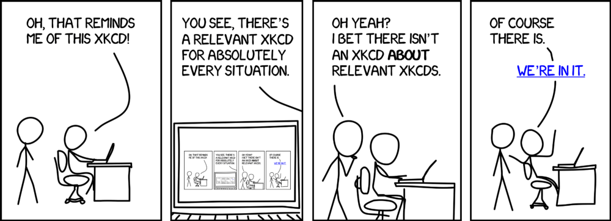

This is a dummy page to test custom [Markdown](https://www.markdownguide.org/) styling on my website.
It can also be used as a Markdown cheat sheet.

```toc
from-heading: 1
to-heading: 2
```

## Meta Data

Markdown supports the use of meta data. This is optional information at the beginning of every Markdown file which does not get displayed.

For example, this page has the following meta data:

```md
---
title: 'Markdown'
slug: markdown
template: page
---
```

While the meta data section is generally option, Markdown files for this blog will at least need to have these meta data fields:

| Field Name | Value                                                                                     |
| ---------- | ----------------------------------------------------------------------------------------- |
| title      | Title of your page. Gets parsed as your first h1 header.                                  |
| slug       | Determines what comes after the slash in ericjanto.com/. Should be unique for every page. |
| template   | Determines which template is used to parse this file. Use article or page.                |

If you're using the `post` template, the required fields are these:

```md
---
date: 2020-05-10
title: 'Starting This Blog'
template: post
slug: starting-this-blog
excerpt:
  'blablabla'
tags:
  - 'student-life'
  - 'productivity'
  - 'notes'
---
```

If you want to colour-code the article, use the tags `computer-science` or `life`, respectively.

Note that the meta data section is separated from the rest of the document using `---` before and after the section.

## Text Styling

This is normal text, flavoured with some _italics_ and some **bold** text. You can also ~~kill~~ strike through text. </br> You can break the text manually using the HTML tag `</br>`.

To start a new paragraph leave a blank line.

```md
This is normal text, flavoured with some _italics_ and some **bold** text. You can also ~~kill~~ strike through text. </br> You can break the text manually using the HTML tag `</br>`.

To start a new paragraph leave a blank line.
```

## Comments

Comments are bits of your file which you don't want parsed and displayed. Markdown does not come with a comment functionality. However, you can use HTML to write comments:

`<!--This is a comment.-->`

## Links

We distinguish between external and internal links. External links link to a foreign web document. Internal links link to a part of this very webpage.

- [Link to ericjanto.com](https://ericjanto.com/)
- [Link to the Headings section of this page](/markdown#headings)

```md
[Link text to ericjanto.com](https://ericjanto.com/)
[Link to the Headings section of this page](/markdown#headings)
```

Note how the internal link does not have a `https://` or `www.` prefix. It rather follows this syntax: `/page-name/#section-title`.

It is good practice and an essential security factor to use meaningful link texts.

## Images

The syntax for images is similar to the syntax for links:

```md

```

If you want to add a subtitle to the image, use single quotes and add a title after the image link.

```

```


## Headings

Use a `#` in front of a line to mark it as a heading. The number of successive `#` determines the degree of the heading. The degree does not only determine the styling (usually smaller for a higher degree) but has also a semantic value used for identation in the table of contents.

```md
# This is how to declare a heading of degree 1 in Markdown.

## This is a heading of degree 2.
```

Heading degrees from `1` to `6` are supported; however, on this website we try to use only headings of degree `2` or `3` within an article to avoid confusing article structures.

## Lists

List can be useful to present various elements within an article in a structured way. We use mainly two types of list on this website:

- Normal bulleted lists which use a `-` in front of each item
- Enumerated lists which use a number in fron of each item, starting with `1`

Bulleted lists can be indented. I usually only use the first identation level to keep it simple.

- Bulleted list
  - With indentation

And here's an enumerated list:

1. Enumerated list
2. Cannot be indented on this website.
  - Try it.

```md
- Bulleted list
  - With indentation

1. Enumerated list
2. Cannot be indented on this website.
  - Try it.
```

A special type of list is the to-do list:

- [x] Finish this page
- [ ] Get your life together

```md
- [x] Finish this page
- [ ] Get your life together
```

## Tables

Markdown tables are instinctive to use.

```md
| Ice Cream Flavour | Rating (1-10) |
| ----------------- | ------------- |
| Lemon             | 8             |
| Maracuja          | 9             |
| Lime              | 9             |
| Vanille           | 8             |
```

The above Markdown code parses like this:

| Ice Cream Flavour | Rating (1-10) |
| ----------------- | ------------- |
| Lemon             | 8             |
| Maracuja          | 9             |
| Lime              | 9             |
| Vanille           | 8             |

You should never need to space tables out yourself. I wrote the above table like below and used `Opt + Shift + F` to automatically format the table. You may need to have a Markdown prettier extension installed for your text editor of choice to do be able to do so.

```md
_Table before formatting_

| Ice Cream Flavour | Rating (1-10) |
| -| -|
| Lemon | 8 |
| Maracuja | 9 |
| Lime | 9 |
| Vanille | 8 |
```

## Quotes

Quotes are useful to let important key aspects of the text stand out.

> Markdown supports custom styling for quotes.
> They can consist of multiple-line text. [This is a link](/).

```md
> Markdown supports custom styling for quotes.
> They can consist of multiple-line text.
```

## Footnotes

This sentence has a footnote.[^1] Footnotes are useful to link to external material or to references without interrupting the flow of the article.

```md
The Markdown syntax for footnotes couldn't be easier.[^1]

[^1]: Text for footnote 1. To be placed at the end of the document.
```

The superscript text of the footnote needs to be a single word, no whitespaces are allowed. Usually, I follow a rigid enumeration system and do not use custom text.

So far, the numbering system needs to be maintained manually. However, Markdown auto-numbers the footnote texts in the reference section[^2], so that's a good way of checking if the enumeration system for the superscript texts is still coherent.

## Code

Write inline-code by wrapping it with single back-ticks: `this is some inline code`.
Use three successive back-ticks ` followed by a language abbreviation to introduce a codeblock.

These language abbreviations are rather intuitive. For example, the code block below would highlight the syntax for Haskell regardless of whether I use `hs` or `haskell` as abbreviation.

```hs
primes = filterPrime [2..]
  where filterPrime (p:xs) =
          p : filterPrime [x | x <- xs, x `mod` p /= 0]
```

The standard codeblock without any language specified looks like this:

```
This is a standard codeblock.
It doesn't support syntax highlighting.
```

## Math Equations

I integrated the KaTeX Gatsby plugin with this blog which enables the parsing of LaTeX syntax in Markdown files. There are two different modes:

1. Inline mode
2. Block mode, also known as display mode

### Inline Mode

Use this mode to express equations or symbols within your flowing text. For instance, we could write $40+2=42$ by using this syntax: `$40+2=42$`.

### Block mode

Use this mode to let mathematical equations stand out in their own block:

$$
  40+2=42
$$

```md
$$
  40+2=42
$$
```

## Table of Contents (ToC)

Gatbsy has a handy ToC plugin which allows to automatically create a ToC by writing this:

````md
[```]toc
from-heading: n
to-heading: m
[```]
````

The limits $n$ and $m$ determine which headings of which degree are included in the ToC, where

$$
  n≤m, n≤1, m≥6.
$$

The square brackets need to be omitted, they are only here because otherwise the code above would be parsed as an actual ToC.

## Graphs

In [my post about graph algorithms](/understanding-graph-algorithms-i/) I relied on Mermaid to create graphs. However, there were cross-platform / -browser issues with that, so I chose to draw graphs by hand (more fun + less time-consuming anyway).

[^1]: This is an example of a footnote.
[^2]: Markdown auto-numbers this very section.
