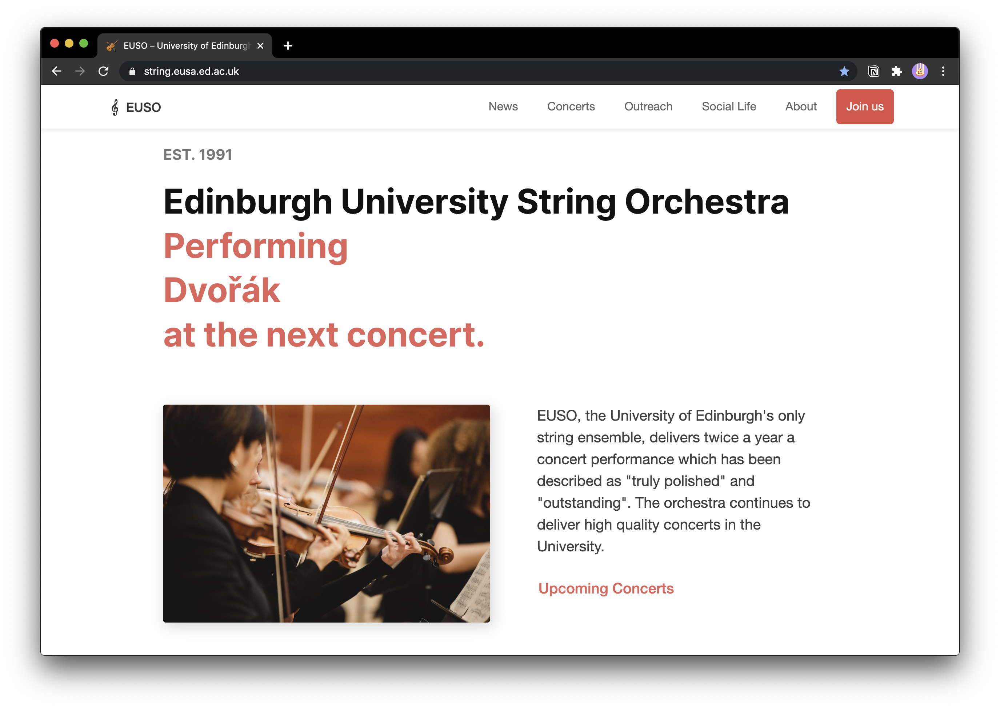
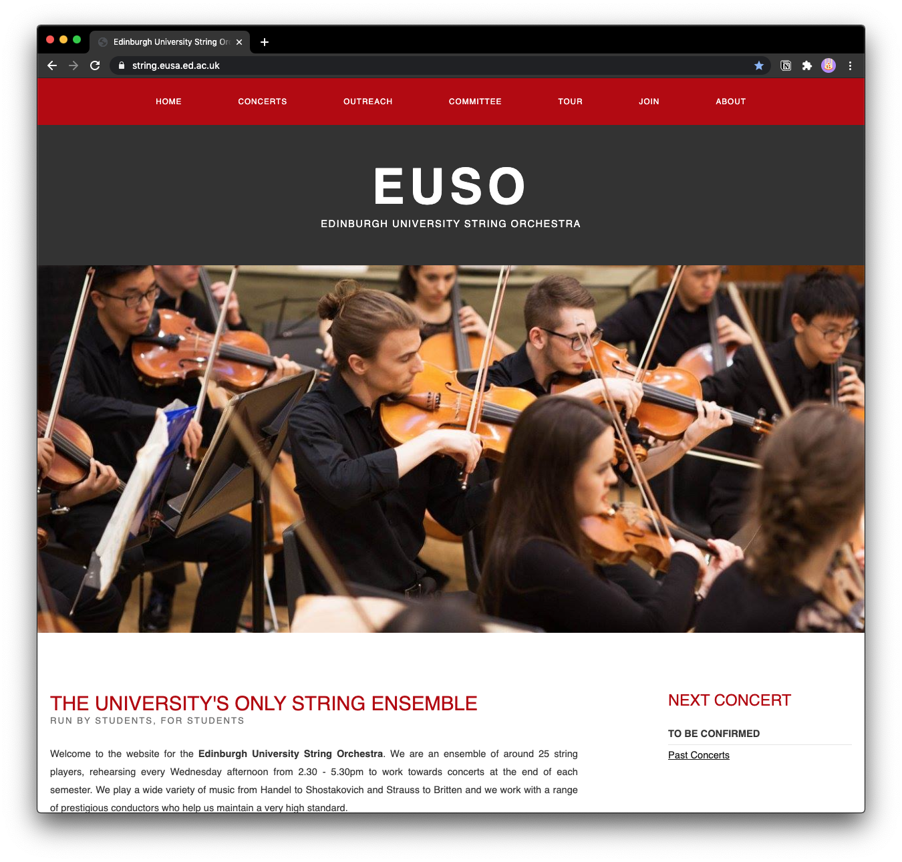

Joining the Edinburgh University String Orchestra was probably one of the best decisions I made since I moved to Edinburgh. The orchestra is famous for its welcoming and friendly atmosphere – this I can only confirm.

Wanting to give something back, I applied for the role of Webmaster and got elected. At that time (around February 2020),
the orchestra's website was a simple HTML site. It worked and got its job done but I wasn't happy with it.

These were the three main reasons why I wanted to build an entirely new website:

- It was slow and not optimised for mobile devices.
- I didn't like the design, it was a bit clunky and looked too much like a 2005 website (see image below).
- It required a huge effort to make edits: each subpage had an own HTML file (which wasn't the worst thing) AND an own CSS file (yep). So if I wanted to change a simple style thing or some content which was on every single subpage (like a concert announcement), I had to change about 10 files. A good example of why [loose coupling](https://en.wikipedia.org/wiki/Loose_coupling) is important.

## Phase 1: Planning

### Features

The first step was to gather information on what features the committee would like to see. I drafted a list and divided it into essential and nice-to-have features.

**Essentials**

- Content / Pages
  - Concerts
  - About
  - Outreach
  - Join
- Blog

**Nice-to-have**

- Content / Pages
  - Social Life
  - Secret Diary
- Newsletter
- Payments
- Live-streaming

### Concept & Tools

**Concept: Functionality > Design**

I had to bear in mind what kind of focus group would visit the website. I supposed the group would consist of

- students looking for an orchestra to join
- potential audience (students + statistically speaking elderly people)
- people trying to connect with us because of our community outreach project

The audience I had to pay the most attention to where elderly people. That's why I went for nothing too fancy, a traditional website layout with footer, navigation bar and main content. The only "special" idea was to draft the main page as a page which leads to the most important subpages.

I sketched a few layouts in my notebook (haven't had the time to learn how to use Figma yet) and then I was almost ready to begin.

The only decision left: which languages and tools should I use?

**Tools**

Just having developed my blog, I thought it would be a good idea to use the same tools, especially because I had a good experience using them. This would allow me to reuse some ideas and components.

- React
- Gatsby
- Node.js
- cPanel (hosting)

I'd definitely recommend the combination of Gatsby and [Netlify]() but I was forced to work with cPanel which was fine in the end. I learned how to deploy Gatsby sites on cPanel and even [wrote a blog post about it](/deploy-gatsby-cpanel/).

## Phase 2: Development

I won't go too much into detail since the entire code is [open source](https://github.com/Edinburgh-University-String-Orchestra/euso-website).

### Features

Here are some aspects I'm proud of / which are cool:

1. I created a typewriter animation to write out the composers' names whose pieces we are going to play at our next concert. I used [this](https://github.com/ianbjorndilling/react-typewriter) react plugin for it. [Click to see the feature](https://string.eusa.ed.ac.uk/).
2. I used GraphQL to fetch the committee data from markdown pages. I created a custom sort which put the three main committee roles (President, Secretary, Treasurer) to the top. The rest is sorted lexicographically. It's about the details. [Click to see the feature](https://string.eusa.ed.ac.uk/committee/).

### Additional Features

- [x] RSS feed
- [x] Easily editable (markdown pages) for subsequent Webmasters of EUSO

It was important to me to make the website as editable as possible, expecting the next Webmaster to be inexperienced in web development (usually we don't have computer science students too often joining our orchestra, and even if, they don't necessarily know HTML or CSS).

The fact that the majority of the website's subpages are going to be markdown pages makes it very easy to change the website content. The only thing which can be tricky is the whole development setup but I figured that I'll be there in person while the Webmaster transition is happening so I can explain everything in detail. So I think I've made it more complicated to get an overview of the entire codebase, but in the long run, it's going to be easier for future Webmasters to make changes to the website.

### Wrap-Up

Looking back to the initial TODO-list, I'm quite happy with the outcome of my development process:

Essentials

- [x] Content / Pages
  - [x] Concerts
  - [x] About
  - [x] Outreach
  - [x] Join
- [x] Blog

Nice-to-have

- [x] Content / Pages
  - [x] Social Life
  - [x] Secret Diary
- [x] Newsletter
- [ ] Payments / Ticket-sell
- [ ] Live-streaming
- [x] RSS feed
- [x] Easily editable

**Payments**: I was initially planning on integrating [stripe]() in combination with [ticketsale]() in my codebase which seemed to be quite uncomplicated given [this Gatsby plugin](). After looking at their pricing, I postponed this feature, supposing that it's simply not worth it for us to sell tickets online. A sad thing since I was looking forward to working myself into the whole stripe technology.

**Live-streaming**: Another feature which I decided to postpone for now. YouTube offers great live-streaming technology + it's for free. The only reasons to have live-streams on this website would be:

1. We want to charge viewers for the watching experience. Seems unlikely for now since classical concerts would require a very high audio quality in the stream to be any near a good concert experience.
2. We want to maintain our integrity and don't want the orchestra to be affiliated to other brands such as Google (YouTube).

## Phase 3: Feedback

Once I had my first release ready, I sent it, published on a test-domain, to our committee. The feedback was positive and they were able to report some minor bugs.

After fixing the bugs, I published the website on [https://string.eusa.ed.ac.uk](https://string.eusa.ed.ac.uk/).

## Personal Outcome

These are the top 3 things I've learned:

1. Progress takes time. I've been working on the website at least 6h a day for more than 3 weeks.
2. I've learned to resist the temptation of publishing something too early. It's hard but it's worth it waiting a few more days to give your project that last finish.
3. I've learned that I should stop coding when I start to fail because of simple tasks. In the evening, I often got frustrated by a problem I could solve within 5min in the next morning.
4. I had to write a documentation. I think I'm finally getting better at writing those things.

I don't know if I'm ever going to need any web development skills at Uni but it was still a good experience and I guess I can never know too much.
