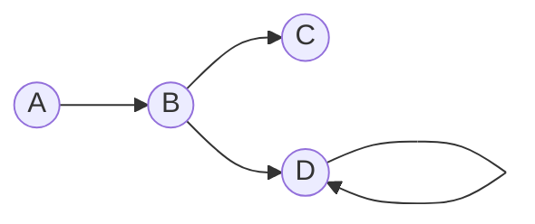
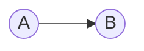
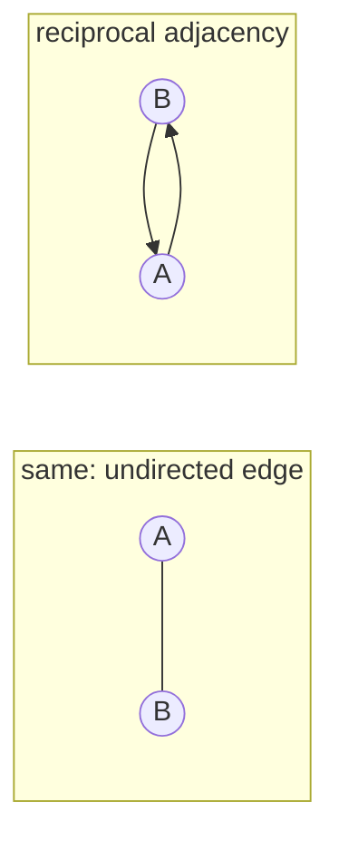
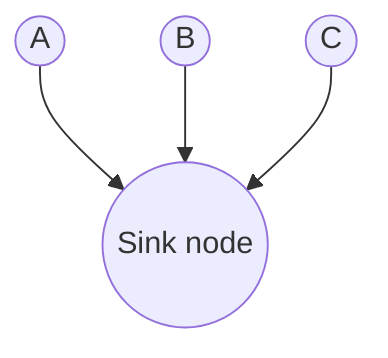
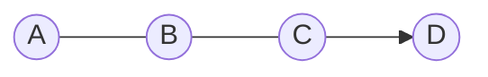

Graphs have many useful applications, ranging from finding the shortest route on a street map to efficiently managing computer networks. Since graph algorithms are an essential part of a standard computer science degree curriculum, I decided to write down and explain the basics to understanding the topic better myself. Here's what I'm going to cover in this article:

```toc
exclude: [Prerequisites, Goals]
from-heading: 1
to-heading: 2
```

## Prerequisites

- (Very) Basic Set Theory
- Properties of Relations (Symmetry)
- Matrices
- Asymptotic Notation

## Goals

- Understand graph theory
- Build a foundation of knowledge for **Understanding Graph Algorithms II: Traversal Algorithms** (not published yet)

# A Bit of Graph Theory

Let's start from scratch. What is a graph? A graph is basically just a structure which consists of a bunch of nodes, formally called *vertices*, and a bunch of lines which connect the vertices, called *edges*.


Here, we have a graph with 3 vertices ($A$, $B$, and $C$) and 3 edges (the lines between the vertices). Later, we'll refer to this graph again, so let's call it $F$.

## Definition of a Graph

Let's try to formalise this a bit more, and define a graph $G$:

$$
G=(V,E),\ where\ V\ is\ a\ set\ and\ E\sube V\times V.
$$

Ok, what are we saying here? We have a graph $G$ which is defined by a set $V$ of vertices and a set $E$ of edges. We also have some additional information: $E$ is a subset of the [Cartesian product](https://en.wikipedia.org/wiki/Cartesian_product) $V\times V$. So by this definition, an edge is just an ordered pair of vertices.

In the example above (graph $F$), $(a,b)$ would be an element of $E$ since there is a line between $a$ and $b$. Similarly, $(a,d)\notin E$.

$V$ and $E$ are sets, so we can write the following:

- $n = |V|$ is the cardinality ('size') of $V$, i.e. the number of vertices
- $m=|E|$ is the cardinality of $E$, i.e. the number of edges

## Visualisation of a Graph

We've seen the visualisation of a graph above. Vertices are represented by labelled circles, and edges are visualised using lines to connect the vertices. Note that we have two different kinds of edges:

- **directed edge**: represented by an arrow, also called *arch*
- **undirected edge**: represented by a plain line

We use *directed* edges when we have an edge going from some vertex $u$ to some vertex $v$ but not vice versa:



We use *undirected* edges when we have an edge going from $u$ to $v$ and another edge going from $v$ to $u$:



## Directed and Undirected Graphs

We have two different types of graphs, directed and undirected graphs. <mark>A graph is undirected if, and only if, all of its edges are undirected.</mark> Otherwise it is directed.
So if a graph has some edge $(a,b)$ (that is, going from vertex $a$ to vertex $b$), it needs to have an edge $(b,a)$ too in order to be undirected. And that must be true for all edges $e\in E$.

From a mathematical perspective, it's also fairly easy to distinguish between these two types. To this end, we note that $E$ is a *binary relation* as it is a subset of a Cartesian product. Let's also recall the definition of a *symmetric* relation:

> Let $R$  be a relation on a set $A$.
A relation $R$ is **symmetric** if, and only if, for every $x,y\in A$, if $xRy$ then $yRx$.

This is just another way of saying that for all pairs $(x,y)$ in $R$, there must also be a complementing pair $(y,x)$. A graph $G=(V,E)$ is undirected if, and only if, $E$ is symmetric.

### More Notation for Directed Graphs

For directed graphs, we have a bit of additional notation. If we pick some random vertex $v$, where $v\in V$, we can write $in(v)$. This denotes the *in-degree* of $v$, that is, the number of incoming edges into $v$.</br>
In a similar manner, we also have $out(v)$, denoting the number of *outgoing* edges from $v$.

A vertex which has only edges going in but no edges going out is also called a *sink* *node*.



## More Graph Properties: Planar and Connected

A graph is *planar* if it is possible to draw the graph (formally, to embed the graph in the plane) so that no edges cross each other.

A graph is *connected* if you start from any vertex and there always exists a path to any other vertex.



This graph is not connected as it has a sink node.

# Graph Representations

Now that we've covered the basic theory of graphs, we can move on to the next problem: how can we represent graphs in memory? What data structures are suitable?

There are two popular approaches:

- Adjacency matrices
- Adjacency lists

## Adjacency Matrices

Let's assume we have some graph $G$ with $n$ vertices. We can name these vertices $0,...,n-1$. Then, the adjacency matrix of $G$ is an $n\times n$ matrix, that is a matrix which has $n$ rows and $n$ columns. Let's call that matrix $A$.

$a_{i,j}$is an entry of $A$, where $i$ indicates the row and $j$ indicates the column. $a_{ij}$is $1$ if there is an edge which goes from vertex $i$ to vertex $j$. Otherwise, $a_{ij}$ is zero.


For our graph $F$, this would be $A$, assuming that the vertices are ordered in lexicographical order:

$$
A =
\begin{pmatrix}
0 & 1 & 0 & 0\\
0 & 0 & 1 & 1\\
0 & 0 & 0 & 0\\
0 & 0 & 0 & 1
\end{pmatrix}
$$

For instance, $a_{4,4}=1$ since $D$ is the 4th vertex and has an edge pointing to itself.

## Adjacency Lists

Let's take $G$ with its $n$ vertices again. We come up with an array with $n$ entries, one for each vertex. Each entry contains a list of all vertices to which the respective node has outgoing edges too. So an entry is a list of vertices *adjacent* to the node for which the entry is.


This adjacency list represents a graph $G=(V,E)$, where
$$
V=\{a,b,c,d,e\}\\
$$
and
$$
E=\{(a,b),(a,d),(a,e),(b,c),(c,d),(d,a)\}.
$$

## Comparison: Adjacency Matrices and Adjacency Lists

I'll just throw this table at your head; explanations (and a bit of additional information) will follow:

| Efficiency Criterium                                  | Adjacency Matrix | Adjacency List    |
|-------------------------------------------------------|------------------|-------------------|
| Space Efficiency                                      | $\Theta (n^2)$   | $\Theta (n+m)$    |
| Time to check if $w$ is adjacent</br>to $v$ (adjacency check) | $\Theta (1)$     | $\Theta (out(v))$ |
| Time to visit all $w$ adjacent</br>to $v$ (adjacency visits)   | $\Theta (n)$     | $\Theta (out(v))$ |
| Time to visit all edges (visit-all)                   | $\Theta (n^2)$   | $\Theta (n+m)$    |

### Advantages of Adjacency Matrices

**Easy Implementation**

Adjacency matrices have a major advantage that they are very easy to implement. We can simply use a two-dimensional array, or even one-dimensional if we use an injective, or ideally bijective, mapping function.

**Good for Undirected-Check**

It's easy to check whether a graph is undirected or not. If it's an undirected graph, the *corresponding adjacency matrix is symmetric* around the diagonal. If you don't know why that is the case, I'd advise you to draw an undirected graph and write down the adjacency matrix.

**Good for Adjacency-Check**

Given that we have direct access to all entries of $A$ using array indices, we can check very efficiently if, given a pair of vertices, they are adjacent, i.e. there exists an edge between the vertices.

Index-accesses and simple comparisons happen within constant time, so worst-case running-time: $\theta (1)$.

### Disadvantages of Adjacency Matrices

**Space-Inefficient Implementation**

We have an $n\times n$ matrix, so the implementation will use up $\theta (n^2)$ space. So rather space-inefficient in comparison to adjacency lists where we don't have all the zeros of $A$.

**Slow Adjacency Visits**

We do have direct access via indices, so we can directly access the row for vertex $u$. However, we don't know which of the cells of that row are $1$ and which are $0$. So we need to go through the entire list which is of length $n$. Worst-case running-time of $\theta (n)$.

**Slow Visit-All**

Similar to the prior section, but now we're going through all $n$ rows and for each row through all $n$ columns. So worst-case running-time of $\theta (n^2)$.

### Advantages of Adjacency Lists

**Space-Efficient Implementation**

In comparison to the adjacency matrix, the adjacency list is a more compact way of representing a graph as we don't have all the zeros of $A$.

The list has $n$ entries and within these entries, all $m$ vertices are split up. So space-efficiency of $\theta (n+m)$.

**Good for Adjacency Visits**

If we want to visit all vertices adjacent to $v$, we simply index into the entry for $v$, a $\theta(1)$ operation, and go through the entry list which has length $out(v)$.

Worst-case running-time of $\theta (out(v))$, pretty good!

**Good for Visiting All Vertices**

We have a faster asymptotic worst-case running-time for visiting all vertices which are adjacent to a given vertex. We simply direct-access the entry for each of $n$ vertices and go along the respective entry list, which has length $m$ in total.

Worst-case running-time of $\theta(n+m)$.

### Disadvantages of Adjacency Lists

**Slow Adjacency Check** *(is $w$ a neighbour of $v$?)*

Since each of the entries of the adjacency list is an unordered list of neighbours, we need to go through the list until we find $w$ (or we don't, then the check evaluates to `False`).

In the worst case, we need to go through the *entire* list. Recall that the length of that list is denoted by $out(v)$. So we have a worst-case running-time of $\theta(out(v))$.

### TL;DR

Use adjacency lists unless the adjacency check plays a major role in your algorithm.

# Additional Bits

*Stuff that is good to know but may not be used in my article series about graphs.*

## Sparse and  Dense Graphs

Recall that $n$ is the number of vertices of a graph. Then, the maximum number of edges is $n^2$. This is easy to understand: if we start with the first vertex $0$, we can have at most $n$ edges going out from $0$, including an edge to itself (yup, that's definitely possible). For vertex $1$, we can also have at most $n$ edges going out from the vertex. And so on, up until vertex $n$. So the maximum number of edges is $n + n +...+n$, with $n$ summands. Hence, at most $n^2$ edges.

Recall that $m$ is the number of edges of a graph $G$. If $m$ is close to $n^2$, we say that $G$ is a *dense* graph. You can think of this property like this: a dense graph is a graph which has proportionally many edges, it is well connected.

If $m$ is much smaller than $n^2$, we call $G$ a *sparse* graph.

There is no exact definition *how much* smaller or *how close* to $n^2$ $m$ should be, these terms are usually used when we're talking asymptotically about a graph, checking whether it hast *most* or *few* edges. In that context, we'd usually talk about $\theta(m)$ rather than $m$ as an exact number.

## The Corollary of Kuratowski's Theorem

[Kuratowski's theorem](https://www.math.cmu.edu/~mradclif/teaching/228F16/Kuratowski.pdf) is useful when working with planar graphs. The theorem has the corollary that

$$
|E|≤3|V|-6.
$$

We can use this to:

1. Check whether a graph is planar given the number of edges $|E|$ and the number of vertices $|V|$. The graph is planar if the inequality remains true.
2. Given the information that a graph is planar, we can use the criterium to obtain a quite tight upper bound for the number of edges. Looking at the inequality, that number will asymptotically be the same as the number of vertices for planar graphs.

## References and Further Reading

- Cryan, Mary. ´Graphs I: graphs, Breadth-first search, Depth-first search.´ Class Lecture, University of Edinburgh, November 14, 2020.
- Cormen, Thomas H., Charles E. Leiserson, Ronald L. Rivest, and Clifford Stein. Introduction to Algorithms, Third Edition. Cambridge, UNITED STATES: MIT Press, 2009. [http://ebookcentral.proquest.com/lib/ed/detail.action?docID=3339142](http://ebookcentral.proquest.com/lib/ed/detail.action?docID=3339142).
    - Section 22.1
- [Radcliffe, Mary. ‘Math 228: Kuratowski’s Theorem’, n.d., 9.](https://www.math.cmu.edu/~mradclif/teaching/228F16/Kuratowski.pdf)
- ‘Cartesian Product’. In Wikipedia, 12 November 2020. [https://en.wikipedia.org/w/index.php?title=Cartesian_product&oldid=988368067](https://en.wikipedia.org/w/index.php?title=Cartesian_product&oldid=988368067.)