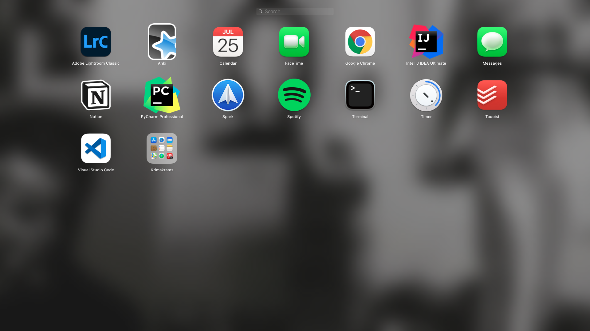
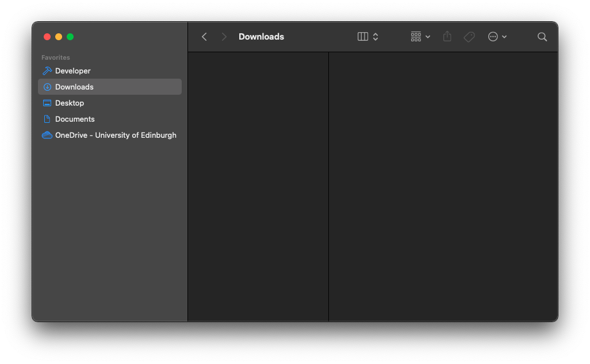

I recently ran out of hard drive memory space and couldn't be bothered to track down and uninstall all the clutter that accumulated over two years of software development. Hence, I reset my MacBook. I used this occasion to create a step-by-step guide on how exactly I reset my mac. It can also be used as a migration guide from one mac to another or an explanation of how to set up a new mac.



### Preparation

1. Do a [Time Machine Backup](https://support.apple.com/en-gb/HT201250), saving it on an external hard drive. It's always wise to do such a backup before trying to apply major changes to your mac.
Should the external hard drive be encrypted, make sure that you haven't saved the password for it on your Mac only so that you can access it after your mac has been erased.
2. Note what applications you want to keep. Get rid of those you don't need anymore. Do some research where you can download them from. See the table at the end of this post to see which ones I chose to keep.
3. Configurations of macOS apps are usually saved in dotfiles, i.e. files starting with a dot, like `.bash_profile`. If you want to use those configurations for your new mac, use [Mackup](https://github.com/lra/mackup#supported-applications) to save the dotfiles (it's [well-documented](https://github.com/lra/mackup/tree/master/doc)) and make sure to keep them somewhere other than the hard drive you're about to erase.
Once you have everything set up, this should be all you need to do:

    ```bash
    # Old mac
    $ mackup backup
    ```

4. Export your [network settings](https://support.apple.com/en-gb/guide/mac-help/mchlp2521/mac) and save them somewhere extern if you want to keep your VPNs etc.

### Reset

Reset your mac following [these steps](https://support.apple.com/en-gb/HT201065).

### New Setup

1. Install the newest macOS.
2. Import and set your network settings.
3. Set most important basic settings in your system preference app, either by using the UI or a file similar to [my `.MacOSX` file](https://github.com/ericjanto/dotfiles/blob/master/Mackup/.MacOSX):

    ```bash
    $ chmod +x .MacOSX
    $ sh .MacOSX
    ```

    The first command gives the file the necessary execution permission. The second command executed the script.

    After that, restart your Mac.

4. Some default options I have yet to include in the `.MacOSX` file, they need manual steps:
    - Keyboard > Input Source > German + English (UK)
    - Language > Primary: UK
    - Trackpad
        - Point & Click
            - Tap to click
            - Click: firm
            - Tracking speed: one right to middle
        - More Gestures
            - App Expoé, three fingers down
    - Accessibility
        - Pointer Control
            - Trackpad options
                - Enable dragging → three-finger drag
    - Change location of where screenshots are saved:

        ```bash
        $ cd
        $ cd Documents
        $ mkdir Screenshots
        ```

        - Open `Screenshot.app` > Options > Saved to `~/Documents/Screenshots`
    - Finder > Settings
        - Settings > New windows show > Downloads
        - Sidebar > Untick iCloud and tags
        - Advanced Settings > When performing a search > Search current folder
        - Sidebar like this:

        

    - Finder > `cmd + shift + h` > Set to column view > `cmd + j` > Always column view and browse in column view
    - Dock > Right click > Untick "Show recent applications in Dock"
    - Background: Download [this photo](https://uoe-my.sharepoint.com/:i:/g/personal/s1975761_ed_ac_uk/EUlxoaxMQmJGgcaoWTMnrP4BtO4HCCeC5LYzAbkfdOebPQ?e=bPHdaE) > Downloads > Right click > Set as desktop picture
5. Set up a basic development environment

    ```bash
    # Create minimalist file/project organisation
    $ cd developer
    $ mkdir Projects Uni
    $ cd

    # Set up git
    $ git config --global user.name "your_github_username"

    # Install CLT for Xcode
    $ xcode-select --install

    # Install Homebrew
    $ /bin/bash -c "$(curl -fsSL https://raw.githubusercontent.com/Homebrew/install/master/install.sh)"
    $ brew update

    # Install npm
    $ brew install node

    # Install node version manager
    $ curl -o- https://raw.githubusercontent.com/nvm-sh/nvm/v0.38.0/install.sh | bash
    $ vim .bash_profile
    # a + paste:
    # export NVM_DIR="$([ -z "${XDG_CONFIG_HOME-}" ] && printf %s "${HOME}/.nvm" || printf %s "${XDG_CONFIG_HOME}/nvm")"
    [ -s "$NVM_DIR/nvm.sh" ] && \. "$NVM_DIR/nvm.sh" # This loads nvm
    # :wq

    # Install yarn
    $ npm i -g yarn
    ```

    1. Install the applications you need. Don't open most of them just yet as Mackup will restore them. I usually go with this order:
        1. Alfred (makes everything else quicker)
        2. Chrome (to download other apps via the web)
        3. The rest in alphabetical order.
    2. Restore app configurations with Mackup.
       1. `brew install mackup`
       2. `mackup restore`
    3. Set up Time Machine.

That's it.

| Name                   | Purpose                        | Source                                                                          | Installation  Notes                                                                                                                                      |
| ---------------------- | ------------------------------ | ------------------------------------------------------------------------------- | -------------------------------------------------------------------------------------------------------------------------------------------------------- |
| Adobe Lightroom CC     | Photo-editing                  | [Adobe Creative Cloud](https://www.adobe.com/uk/creativecloud/desktop-app.html) |                                                                                                                                                          |
| Alfred                 | OS Navigation + miscellaneous  | [aldredapp.com](https://www.alfredapp.com/)                                     |                                                                                                                                                          |
| Anki                   | App for spaced-repition system | [apps.ankiweb.net](https://apps.ankiweb.net/)                                   |                                                                                                                                                          |
| AppCleaner             | Delete mac apps the clean way  | [freemacsoft.net/appcleaner](https://freemacsoft.net/appcleaner/)               |                                                                                                                                                          |
| Calibre                | Book management for my Kindle  | [calibre-ebook.com/download](https://calibre-ebook.com/download)                |                                                                                                                                                          |
| Dozer                  | Tidy menu bar                  | `brew install --cask dozer`                                                     | `cmd + shift + s` to toggle                                                                                                                              |
| Google Chrome          | Daily web-browsing + web dev   | [google.co.uk/chrome](https://www.google.co.uk/chrome/)                         | Sign into Chrome with your google account to automatically import your bookmarks and extensions </br> </br> Extensions: UBlockOrigin, DuckDuckGo, Vimium |
| IntelliJ IDEA Ultimate | Java IDE                       | [JetBrains Toolbox](https://www.jetbrains.com/toolbox-app/)                     | Sync options from account                                                                                                                                |
| OneDrive               | Cloud Space                    | Apple App Store                                                                 |                                                                                                                                                          |
| PyCharm Professional   | Python IDE                     | [JetBrains Toolbox](https://www.jetbrains.com/toolbox-app/)                     | Sync options from account                                                                                                                                |
| Quick Draft            | Quick menu bar notepad         | Apple App Store                                                                 | `cmd + d`                                                                                                                                                |
| Rectangle              | Window resizing + positioning  | [rectangleapp.com](https://rectangleapp.com/)                                   |                                                                                                                                                          |
| Spark                  | Email                          | Apple App Store                                                                 |                                                                                                                                                          |
| Spotify                | Music streaming                | [spotify.com](https://www.spotify.com/us/download/mac/)                         |                                                                                                                                                          |
| Timer                  | Pomodoro and timing stuff      | [Github](https://github.com/michaelvillar/timer-app/releases)                   |                                                                                                                                                          |
| Visual Studio Code     | All-purpose text-editor        | [code.visualstudio.com](https://code.visualstudio.com/Download)                 |                                                                                                                                                          |
| Zoom                   | Non-personal video calls       | [zoom.us/download](https://zoom.us/download)                                    |                                                                                                                                                          |