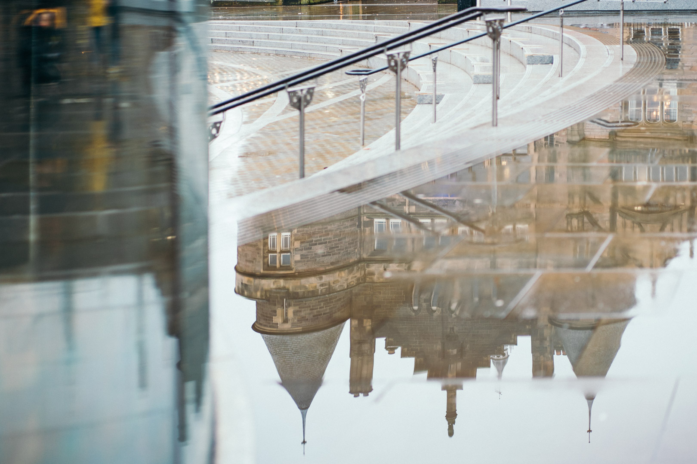

Last September, I moved to Edinburgh to go to uni, equipped with a suitcase, a bag and my violin. It would be the first time that I would be living on my own, away from my family, friends and familiar environment. Here's what I experienced in my first year.

```toc
from-heading: 2
to-heading: 2
```

## Friends
Let me start with the topic which worried me the most before I started uni: finding new and good friends. At school, fixed seating plans mainly did the job for me (I'd just befriend my neighbour), but this method seemed unreliable to me because of the vast number of course participants (400+) and random seating. In reality, it was still possible to find friends by seeing the same people over and over again by always choosing the same seat in our lecture theatre (there are always people who also have a favourite seat), or in small tutorial groups. While I would consider myself a rather shy and introverted person when surrounded by unfamiliar people, I've learned that it's easy for me to make friends whenever I see the same people regularly over a longer period. My only job was to create such an environment. That's one of the main reasons why I decided to join the uni orchestra and the swimming club, where I finally found myself surrounded by friends sharing the same interests and values.

## Language
Speaking in a foreign language was my second biggest concern when I moved to Scotland. Having had English lessons for 7 years at school, I had a solid foundation of vocabulary and grammar. However, we didn't practice speaking English during these lessons that much. Given that, I was fairly surprised when I found out that my initial speaking and understanding skills were good enough to get through lectures and tutorials with ease. Since most of my courses were maths- or coding-based anyway, there weren't too many fancy words I didn't know.<br>
The hard part was understanding English at events where there were many people or a lot of background noise (flat dinners, parties etc.). Often I wouldn't get what my conversation partner said and I would just nod and laugh which most of the time led to awkward misunderstandings.<br>
I started to think and to dream in English after ~3-4 weeks. It was a strange experience. After 5 or 6 weeks I became much more fluent, not necessarily because I had more vocabulary or better grammar, but rather because I didn't fear making mistakes anymore since I noticed that nobody cared how good or bad my grammar was as long as they understood me.<br>
I still have to get much better at English, especially at understanding people with a heavy Scottish accent, but as of today, it almost feels more natural to speak in English than in German.

## Music
Having spent quite a lot of time playing the violin and the piano, I didn't want to give up my musical life. I bought a pass which gave me access to practice rooms with grand pianos. For the first time in my life I could practice on a grand piano; it was a terrific feeling.


I also auditioned for two orchestras and became a first violin in both of them. After that, I could be certain that my musical life would be more or less secured.<br>
The real challenge was to integrate practice and rehearsal time into my already time-consuming academic schedule. A good solution was to study in a room which was close to the practice rooms. In my case, that was the *micro lab* in the building of the music faculty. While I'm positive that all the hours I spend in this horrible room with its neon-white hospital lighting and windowless walls caused PTSD, being able to go downstairs to practice the piano whenever I wanted to take a break came in handy.<br>
During my first year, I learned how stress-relieving making music can be, especially during exam time.

## Swimming
Apart from music, I also wanted to keep on doing swimming (competitively). For the past few years, I had 4 swimming sessions a week but I always wanted to have more of them. When I joined the uni swimming society, I could attend 3 swimming sessions a day if I wanted. Ironically, I ended up going to no more than ~15 sessions throughout the entire year (including a few very painful sessions at 5.30am). The reason for that is that swimming is very time-consuming and I decided to spend my non-academic time on music and with my orchestra friends.<br>
To keep up a decent level of sportiness, I went bouldering. It was convenient to live a 5 minute walk far from the gym with the bouldering room, so I'd go there for a quick session to take a break from studying and half an hour later, I could be more productive having exercised and taken a shower.<br>
Although I won't join the swimming society again next year, it was a good experience and I found good friends. In the first semester, I took part in a uni competition (Edinburgh vs St Andrews) and we crushed them (which was mainly because we had an [Olympian](https://en.wikipedia.org/wiki/Nicholas_Quinn_(swimmer)) swimming for us).

## Academia

I'm studying Artificial Intelligence (AI) and Computer Science (CS) at the University of Edinburgh. It's a 4-year degree and I'm going into 2nd year. My first year was (academic-wise) a bit less challenging than I'd have wished. Although my first-year grades don't count toward the final mark of my Bachelor's degree, I was aiming for good grades in my CS classes since I wanted to become a tutor in 2nd year.<br>
In total, I had 4 CS-related courses (if we take maths courses into account) and 2 electives which could be any first-year course outwith the school of medicine and law. For my electives, I chose *Topics in Popular Music* and *French 2*. I wanted something unrelated to CS since I was expecting to spend 90% of my time on maths and programming anyways. In retrospect, I would have chosen an additional CS-related course such as *Proofs and Problem Solving* or *Computer Simulation*.

I was a bit disappointed that we didn't have any courses related to AI but I guess that makes sense since we need to have a proper CS foundation first.

### The Uni
I chose the University of Edinburgh over the Technical University of Munich since rankings and research suggested that I would learn more about AI at Edinburgh. Also, my plan is to do my masters at the TUM anyway, so that I can see and experience both cities and unis.

- Teaching is quite good, I'd give it a 6/10 since there are very few contact hours.
- Quite hard to get into (my professor mentioned a 10% acceptance rate for my degree), so there are very talented people in my course.
- I wouldn't go there if I had to pay tuition fees, because there are German unis which have more or less the same reputation within employer circles; they provide a similar quality of teaching, and I wouldn't have to pay tuition fees.

### Environment of the University
I was fascinated when I observed a significant change in my mindset: once I was surrounded by all of these bright minds, I felt the *urge* to study, to learn more — as opposed to my mindset at school, where I often did as little as possible to have more time to spend with my friends, to make music or to exercise. But once at uni, I wanted to learn so much that the real challenge was to choose wisely what to learn and what not to learn.<br>
Let me give an example: back in school, I had an advanced Latin course. I never did particularly much for that course as the teaching was very good and I was engaged enough in the Latin lessons themselves to do well enough (I was best of my class for most of the years).<br>
Once at uni, I somehow started to want to learn more about Latin; to improve my translation skills and to get back to ancient philosophy. The only problem was that at the same time, I had to learn about recursion, matrix diagonalisation and data abstraction. So, not the best time to dive into Vergil's Aeneid. I had to decide deliberately not to learn Latin. I've accepted that it's just too time-consuming to maintain my Latin translation skills, so instead I read some translations from time to time, so as to maintain at least my knowledge of Latin (reading Ovid's _Ars Amatoria_ at the moment, very… amusing ahem).

### First Semester

*You can [skip](/first-year/#lockdown) to the next bit if you're not interested in my course details.*

In terms of academic content, my first semester was not really challenging. Just 2 or 3 weeks in, I knew that I would pass all my courses. Nonetheless, I had difficulties establishing a proper learning routine, mainly because I had to get adjusted to a new culture, language and circle of friends.<br>
Here's a summary of my courses:

#### Introduction to Linear Algebra
- Learned: vectors, matrices & Gaussian elimination, span, subspaces, eigenvalues, orthogonal diagonalization, ...
- Half of the course was already covered in my advanced maths course at school
- Well taught but very time-consuming (4 tests/exercise papers each week, counting for 20% of the final mark)
- The only course which was still quite challenging, not in the understanding of content but in the sheer amount of knowledge they required us to consume and learn… in the 4th week of lectures I'd have forgotten most of the 1st week's content -> that's why I'm trying out a spaced repetition system next year
- I've heard that linear algebra is essential for AI, so I revised most of the content during lockdown; now I'd consider myself fairly confident in these topics

#### Introduction to Computation
This course consisted of two sub-courses: Introduction to Functional Programming and Computational Logic.

**Functional Programming**
- Learned: Haskell, recursion, list comprehension, functions & composition, tacit programming (loved that one), data structures (lists, trees), data abstraction, algebraic data, higher-order functions, etc.
- Well taught, professor was on the committee which developed Haskell; he was pretty cool
- Learned to love Haskell; it's very clean and elegant — I don't know where to apply it though

**Computational Logic**
- Learned: truth tables, Syllogisms, FSM, Propositional Logic, Karnaugh Maps, NFA, regex, etc.
- Bad professor (I liked him but he was unable to teach) / bad organised, I didn't get the gist of why we were learning this
- Didn't learn very much, I memorised a few past papers the day before the final exam, that was enough to pass the course
- I was fascinated about how easy it was to implement custom representations of a logic problem in Haskell

#### Topics in Popular Music (Elective)
- Learned about: what is popular music, African American influences on popular music, working-class country culture, gender and race in popular music, etc.
- Really good lectures and tutorials
- Didn't focus on this course but it was good language practice; I had to write 3 essays over the course, and even got an A in one of them

### Second Semester
In contrast to my first semester, I started this semester having an established friend circle and improved language proficiency. I could finally focus solely on my studies, which resulted directly in an improvement of my performance. I was constantly ahead of my course work and could start revising past papers after week 6 / 7 of 12 lecture-weeks.
Unfortunately, that was about the time when COVID-19 began so all of my exams were cancelled. Since my French and programming courses were mainly based on coursework (i.e. intense projects and in-class tests), you could say that the calculus exam was the only one I'd have had to study for.

#### Calculus and Its Applications
- Learned: limit laws, derivatives & rules, inverse functions, integration techniques, sequences, series (power, Maclaurin), tests (integral, comparison, convergence)
- Well taught, different tutors/professors for each 4-week cycle, which allowed them to specialise in their topic
- Initially thought that it'd be nothing new after my last advanced maths year at school -> same topics but in much more depth and with harder problems

#### Object-Oriented Programming
- Learned: conditionals & loops, data structures (arrays, lists, hash maps, sets, ...), stack & heap, classes, objects, instances, static functions, inheritance, abstract classes, interfaces, VSC
- Very well-taught, professor young and motivated
- No exam but a [final project]([https://github.com/ericjanto/Library-Database-Project](https://github.com/ericjanto/Library-Database-Project)), which makes much more sense to me (I learn more from it in the long run)

#### French 2 (Elective)
- Chose this course because I wanted to maintain my French skills to leave a door open to study in France at some future time (not decided yet)
- Learned: new vocabulary, conjugation, passé composé, l'imparfait, passé recent, le but, le futur, le conditionnel
- Grammar-wise too easy; I should have chosen French 3, but still learned a lot because there was much speaking in French involved

## Lockdown
In March, I decided to fly back to Germany to stay during with my family lockdown. While for many people, the pandemic and lockdown, unfortunately, brought with it many difficult and lamentable implications , that period was the most productive and self-improving time I've ever had in my entire life. I finished the required coursework and the final project for OOP and then started working on personal projects. During that time, I

- [started this blog](/starting-this-blog/),
- joined a software team in Munich to help improve the [BreakOut Project](https://break-out.org),
- started to learn Swift and planned to compete for the Apple WWDC Scholarship,
- worked on the official [corona app](https://www.coronawarn.app/en/) for the German government to trace down and break infection chains at an early stage, and I
- created a [new website](https://string.eusa.ed.ac.uk) for the Edinburgh University String Orchestra (with amazing artwork from [Tara](https://www.instagram.com/tara___etc___/)).

I also worked a lot on my mental health, productivity (I received a [Roam Research](https://roamresearch.com) scholarship), music and swimming.

At the end of July, I decided to fly back to Edinburgh to seize the opportunity to see more of Edinburgh and the UK. I finally had more time for one of my favourite hobbies, [photography](https://www.instagram.com/ericjanto/):


## The City
There are too many aspects of Edinburgh that I love to list all of them. Here are a few:
  
  - The area of city relevant for AI & CS students can be narrowed down to a small central area where everything can be reached by walking -> it feels like living in a small town rather than in the capital of Scotland.
  - If you go up only a few floors in a building, you'll usually have a stunning view of the entire city. Edinburgh doesn't have many high buildings to block the view.
  - The North Sea, Pentland Hills, 7 Hills (Rome?), the Meadows
  - £5 Usher Hall Tickets
  - Countless little cafés
  - The weather isn't that bad


The best thing, though, might be the community and atmosphere of the city. I felt welcomed from the first second I stepped across the Scottish / UK border (literally — the officer tried to make small talk with me, which failed because of my shaky English back then). Moreover, there is always something going on with music, be it free daily lunch concerts, outstanding concerts by professionals in Usher Hall or live music in some café.


The thing is that you'll never experience the true nature if you're only a tourist. You'd have to live here, be a student here.
Walking up Arthur's Seat is nice, but walking up Arthur's Seat with some of your best friends is wonderful.


## Goals For Next Year
While my first year was overall a good experience, there are a few things I want to change next year:

- [ ] Do better in academics (i.e. invest more time here, less in music/sport)
- [ ] Get more involved with informatics community
- [ ] Combine music + CS in personal projects
- [ ] Learn how to play the guitar by practising 10min a day
- [ ] See more of Scotland (Skye)
- [ ] Don't go back to micro lab
- [ ] Establish a healthy sleep pattern

## The End

One year later, I'm surprised to find myself in this beautiful city studying something I'm genuinely interested in. I have a lovely group of friends around me, and enjoy music more than ever before. I'm excited to see what the next years will be like. I have the vague feeling that these are going to be the best years of my life.

---





