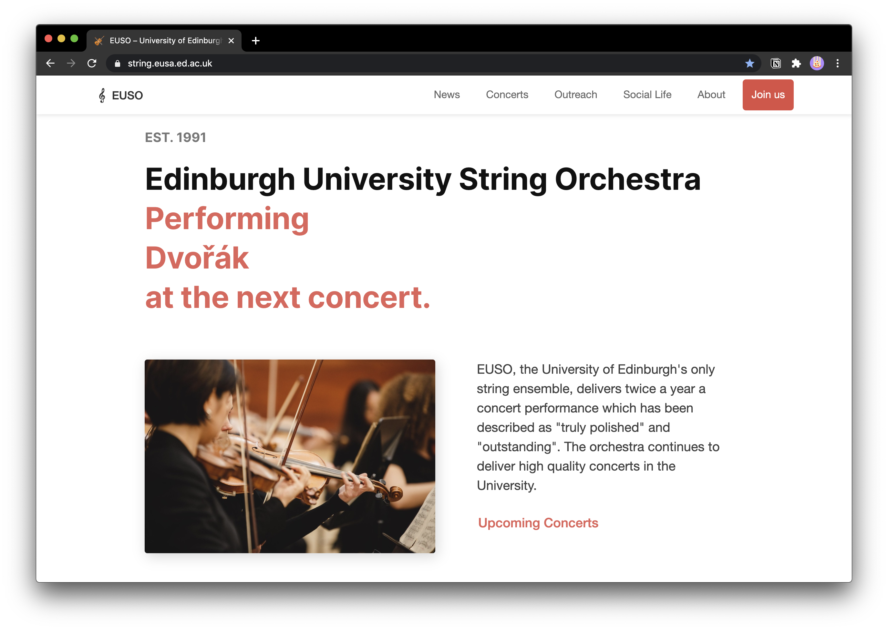
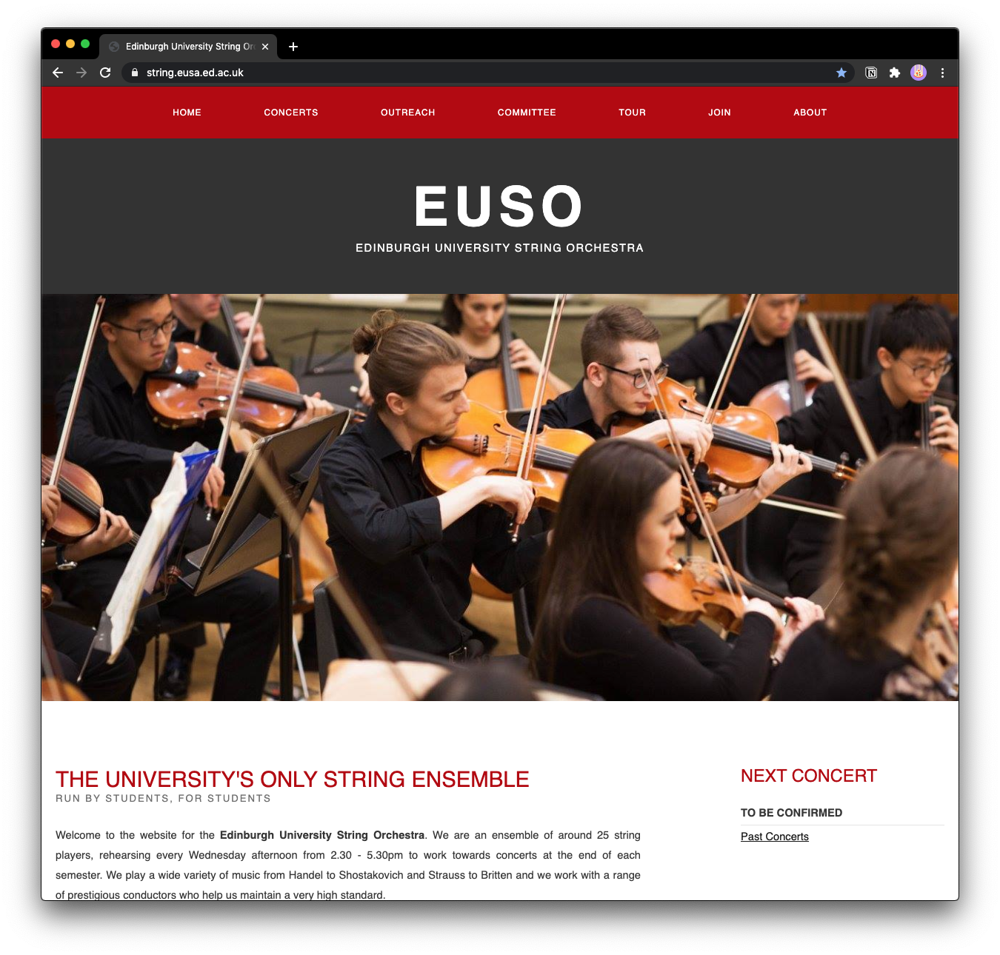

**Joini**ng **th**e **Edinbur**gh **Universi**ty **Stri**ng **Orchest**ra **wa**s **probab**ly **on**e **o**f **th**e **bes**t **decisio**ns I **mad**e **sin**ce I **mov**ed **t**o **Edinbur**gh. **Th**e **orchest**ra **i**s **famo**us **fo**r **it**s **welcomi**ng **an**d **friend**ly **atmosphe**re – **thi**s I **ca**n **onl**y **confi**rm.

**Wanti**ng **t**o **giv**e **somethi**ng **bac**k, I **appli**ed **fo**r **th**e **rol**e **o**f **Webmast**er **an**d **go**t **elect**ed. **A**t **tha**t **tim**e (**arou**nd **Februa**ry 2020),
**th**e **orchest**ra's **websi**te **wa**s a **simp**le **HTM**L **sit**e. **I**t **work**ed **an**d **go**t **it**s **jo**b **don**e **bu**t I **was**n't **hap**py **wit**h **i**t.

**The**se **wer**e **th**e **thr**ee **mai**n **reaso**ns **wh**y I **want**ed **t**o **bui**ld **a**n **entire**ly **ne**w **websi**te:

- **I**t **wa**s **slo**w **an**d **no**t **optimis**ed **fo**r **mobi**le **devic**es.
- I **did**n't **lik**e **th**e **desi**gn, **i**t **wa**s a **bi**t **clun**ky **an**d **look**ed **to**o **muc**h **lik**e a 2005 **websi**te (**se**e **ima**ge **bel**ow).
- **I**t **requir**ed a **hug**e **effo**rt **t**o **mak**e **edi**ts: **eac**h **subpa**ge **ha**d **a**n **ow**n **HTM**L **fil**e (**whi**ch **was**n't **th**e **wor**st **thi**ng) **AN**D **a**n **ow**n **CS**S **fil**e (**ye**p). **S**o **i**f I **want**ed **t**o **chan**ge a **simp**le **sty**le **thi**ng **o**r **som**e **conte**nt **whi**ch **wa**s **o**n **eve**ry **sing**le **subpa**ge (**lik**e a **conce**rt **announceme**nt), I **ha**d **t**o **chan**ge **abo**ut 10 **fil**es. A **goo**d **examp**le **o**f **wh**y [**loo**se **coupli**ng](https://en.wikipedia.org/wiki/Loose_coupling) **i**s **importa**nt.

## **Pha**se 1: **Planni**ng

### **Featur**es

**Th**e **fir**st **ste**p **wa**s **t**o **gath**er **informati**on **o**n **wha**t **featur**es **th**e **committ**ee **wou**ld **lik**e **t**o **se**e. I **draft**ed a **lis**t **an**d **divid**ed **i**t **int**o **essenti**al **an**d **nic**e-**t**o-**hav**e **featur**es.

****Essentia**ls**

- **Conte**nt / **Pag**es
  - **Concer**ts
  - **Abo**ut
  - **Outrea**ch
  - **Joi**n
- **Blo**g

****Nic**e-**t**o-**hav**e**

- **Conte**nt / **Pag**es
  - **Soci**al **Lif**e
  - **Secr**et **Dia**ry
- **Newslett**er
- **Paymen**ts
- **Liv**e-**streami**ng

### **Conce**pt & **Too**ls

****Conce**pt: **Functional**ity > **Desi**gn**

I **ha**d **t**o **bea**r **i**n **min**d **wha**t **kin**d **o**f **foc**us **gro**up **wou**ld **vis**it **th**e **websi**te. I **suppos**ed **th**e **gro**up **wou**ld **consi**st **o**f

- **studen**ts **looki**ng **fo**r **a**n **orchest**ra **t**o **joi**n
- **potenti**al **audien**ce (**studen**ts + **statistica**lly **speaki**ng **elder**ly **peop**le)
- **peop**le **tryi**ng **t**o **conne**ct **wit**h **u**s **becau**se **o**f **ou**r **communi**ty **outrea**ch **proje**ct

**Th**e **audien**ce I **ha**d **t**o **pa**y **th**e **mos**t **attenti**on **t**o **whe**re **elder**ly **peop**le. **Tha**t's **wh**y I **wen**t **fo**r **nothi**ng **to**o **fan**cy, a **tradition**al **websi**te **layo**ut **wit**h **foot**er, **navigati**on **ba**r **an**d **mai**n **conte**nt. **Th**e **onl**y "**speci**al" **ide**a **wa**s **t**o **dra**ft **th**e **mai**n **pag**e **a**s a **pag**e **whi**ch **lea**ds **t**o **th**e **mos**t **importa**nt **subpag**es.

I **sketch**ed a **fe**w **layou**ts **i**n **m**y **notebo**ok (**hav**en't **ha**d **th**e **tim**e **t**o **lea**rn **ho**w **t**o **us**e **Fig**ma **ye**t) **an**d **the**n I **wa**s **almo**st **rea**dy **t**o **beg**in.

**Th**e **onl**y **decisi**on **lef**t: **whi**ch **languag**es **an**d **too**ls **shou**ld I **us**e?

****Too**ls**

**Jus**t **havi**ng **develop**ed **m**y **blo**g, I **thoug**ht **i**t **wou**ld **b**e a **goo**d **ide**a **t**o **us**e **th**e **sam**e **too**ls, **especial**ly **becau**se I **ha**d a **goo**d **experien**ce **usi**ng **the**m. **Thi**s **wou**ld **all**ow **m**e **t**o **reu**se **som**e **ide**as **an**d **componen**ts.

- **Rea**ct
- **Gats**by
- **Nod**e.**j**s
- **cPan**el (**hosti**ng)

I'd **definite**ly **recomme**nd **th**e **combinati**on **o**f **Gats**by **an**d [**Netli**fy]() **bu**t I **wa**s **forc**ed **t**o **wor**k **wit**h **cPan**el **whi**ch **wa**s **fin**e **i**n **th**e **en**d. I **learn**ed **ho**w **t**o **depl**oy **Gats**by **sit**es **o**n **cPan**el **an**d **eve**n [**wro**te a **blo**g **pos**t **abo**ut **i**t](/deploy-gatsby-cpanel/).

## **Pha**se 2: **Developme**nt

I **wo**n't **g**o **to**o **muc**h **int**o **deta**il **sin**ce **th**e **enti**re **cod**e **i**s [**ope**n **sour**ce](https://github.com/Edinburgh-University-String-Orchestra/euso-website).

### **Featur**es

**Her**e **ar**e **som**e **aspec**ts I'm **pro**ud **o**f / **whi**ch **ar**e **coo**l:

1.  I **creat**ed a **typewrit**er **animati**on **t**o **wri**te **ou**t **th**e **compose**rs' **nam**es **who**se **piec**es **w**e **ar**e **goi**ng **t**o **pla**y **a**t **ou**r **nex**t **conce**rt. I **use**d [**thi**s](https://github.com/ianbjorndilling/react-typewriter) **rea**ct **plug**in **fo**r **i**t. [**Cli**ck **t**o **se**e **th**e **featu**re](https://string.eusa.ed.ac.uk/).
2.  I **use**d **Graph**QL **t**o **fet**ch **th**e **committ**ee **dat**a **fro**m **markdo**wn **pag**es. I **creat**ed a **cust**om **sor**t **whi**ch **pu**t **th**e **thr**ee **mai**n **committ**ee **rol**es (**Preside**nt, **Secreta**ry, **Treasur**er) **t**o **th**e **to**p. **Th**e **res**t **i**s **sort**ed **lexicographica**lly. **I**t's **abo**ut **th**e **detai**ls. [**Cli**ck **t**o **se**e **th**e **featu**re](https://string.eusa.ed.ac.uk/committee/).

### **Addition**al **Featur**es

- [x] **RS**S **fee**d
- [x] **Easi**ly **editab**le (**markdo**wn **pag**es) **fo**r **subseque**nt **Webmaste**rs **o**f **EUS**O

**I**t **wa**s **importa**nt **t**o **m**e **t**o **mak**e **th**e **websi**te **a**s **editab**le **a**s **possib**le, **expecti**ng **th**e **nex**t **Webmast**er **t**o **b**e **inexperien**ced **i**n **we**b **developme**nt (**usual**ly **w**e **do**n't **hav**e **comput**er **scien**ce **studen**ts **to**o **oft**en **joini**ng **ou**r **orchest**ra, **an**d **eve**n **i**f, **the**y **do**n't **necessari**ly **kno**w **HTM**L **o**r **CS**S).

**Th**e **fac**t **tha**t **th**e **majori**ty **o**f **th**e **websi**te's **subpag**es **ar**e **goi**ng **t**o **b**e **markdo**wn **pag**es **mak**es **i**t **ver**y **eas**y **t**o **chan**ge **th**e **websi**te **conte**nt. **Th**e **onl**y **thi**ng **whi**ch **ca**n **b**e **tric**ky **i**s **th**e **who**le **developme**nt **set**up **bu**t I **figur**ed **tha**t I'**l**l **b**e **the**re **i**n **pers**on **whi**le **th**e **Webmast**er **transiti**on **i**s **happeni**ng **s**o I **ca**n **expla**in **everythi**ng **i**n **deta**il. **S**o I **thi**nk I'**v**e **mad**e **i**t **mor**e **complicat**ed **t**o **ge**t **a**n **overvi**ew **o**f **th**e **enti**re **codeba**se, **bu**t **i**n **th**e **lon**g **ru**n, **i**t's **goi**ng **t**o **b**e **easi**er **fo**r **futu**re **Webmaste**rs **t**o **mak**e **chang**es **t**o **th**e **websi**te.

### **Wra**p-**U**p

**Looki**ng **bac**k **t**o **th**e **initi**al **TOD**O-**lis**t, I'm **qui**te **hap**py **wit**h **th**e **outco**me **o**f **m**y **developme**nt **proce**ss:

**Essentia**ls

- [x] **Conte**nt / **Pag**es
  - [x] **Concer**ts
  - [x] **Abo**ut
  - [x] **Outrea**ch
  - [x] **Joi**n
- [x] **Blo**g

**Nic**e-**t**o-**hav**e

- [x] **Conte**nt / **Pag**es
  - [x] **Soci**al **Lif**e
  - [x] **Secr**et **Dia**ry
- [x] **Newslett**er
- [ ] **Paymen**ts / **Tick**et-**sel**l
- [ ] **Liv**e-**streami**ng
- [x] **RS**S **fee**d
- [x] **Easi**ly **editab**le

****Paymen**ts**: I **wa**s **initial**ly **planni**ng **o**n **integrati**ng [**stri**pe]() **i**n **combinati**on **wit**h [**ticketsa**le]() **i**n **m**y **codeba**se **whi**ch **seem**ed **t**o **b**e **qui**te **uncomplica**ted **giv**en [**thi**s **Gats**by **plug**in](). **Aft**er **looki**ng **a**t **the**ir **prici**ng, I **postpon**ed **thi**s **featu**re, **supposi**ng **tha**t **i**t's **simp**ly **no**t **wor**th **i**t **fo**r **u**s **t**o **sel**l **ticke**ts **onli**ne. A **sa**d **thi**ng **sin**ce I **wa**s **looki**ng **forwa**rd **t**o **worki**ng **myse**lf **int**o **th**e **who**le **stri**pe **technolo**gy.

****Liv**e-**streami**ng**: **Anoth**er **featu**re **whi**ch I **decid**ed **t**o **postpo**ne **fo**r **no**w. **YouTu**be **offe**rs **gre**at **liv**e-**streami**ng **technolo**gy + **i**t's **fo**r **fre**e. **Th**e **onl**y **reaso**ns **t**o **hav**e **liv**e-**strea**ms **o**n **thi**s **websi**te **wou**ld **b**e:

1.  **W**e **wan**t **t**o **char**ge **viewe**rs **fo**r **th**e **watchi**ng **experien**ce. **See**ms **unlike**ly **fo**r **no**w **sin**ce **classic**al **concer**ts **wou**ld **requi**re a **ver**y **hig**h **aud**io **quali**ty **i**n **th**e **stre**am **t**o **b**e **an**y **nea**r a **goo**d **conce**rt **experien**ce.
2.  **W**e **wan**t **t**o **mainta**in **ou**r **integri**ty **an**d **do**n't **wan**t **th**e **orchest**ra **t**o **b**e **affiliat**ed **t**o **oth**er **bran**ds **suc**h **a**s **Goog**le (**YouTu**be).

## **Pha**se 3: **Feedba**ck

**Onc**e I **ha**d **m**y **fir**st **relea**se **rea**dy, I **sen**t **i**t, **publish**ed **o**n a **tes**t-**doma**in, **t**o **ou**r **committ**ee. **Th**e **feedba**ck **wa**s **positi**ve **an**d **the**y **wer**e **abl**e **t**o **repo**rt **som**e **min**or **bug**s.

**Aft**er **fixi**ng **th**e **bug**s, I **publish**ed **th**e **websi**te **o**n [**htt**ps://**stri**ng.**eus**a.**e**d.**a**c.**u**k](https://string.eusa.ed.ac.uk/).

## **Person**al **Outco**me

**The**se **ar**e **th**e **to**p 3 + 1 **thin**gs I'**v**e **learn**ed:

1.  **Progre**ss **tak**es **tim**e. I'**v**e **bee**n **worki**ng **o**n **th**e **websi**te **a**t **lea**st **6**h a **da**y **fo**r **mor**e **tha**n 3 **wee**ks.
2.  I'**v**e **learn**ed **t**o **resi**st **th**e **temptati**on **o**f **publishi**ng **somethi**ng **to**o **ear**ly. **I**t's **har**d **bu**t **i**t's **wor**th **i**t **waiti**ng a **fe**w **mor**e **day**s **t**o **giv**e **you**r **proje**ct **tha**t **las**t **fini**sh.
3.  I'**v**e **learn**ed **tha**t I **shou**ld **sto**p **codi**ng **whe**n I **sta**rt **t**o **fai**l **becau**se **o**f **simp**le **tas**ks. **I**n **th**e **eveni**ng, I **oft**en **go**t **frustrat**ed **b**y a **probl**em I **cou**ld **sol**ve **with**in **5mi**n **i**n **th**e **nex**t **morni**ng.
4.  I **ha**d **t**o **wri**te a **documentat**ion. I **thi**nk I'm **final**ly **getti**ng **bett**er **a**t **writi**ng **tho**se **thin**gs.

I **do**n't **kno**w **i**f I'm **eve**r **goi**ng **t**o **nee**d **an**y **we**b **developme**nt **skil**ls **a**t **Un**i **bu**t **i**t **wa**s **sti**ll a **goo**d **experien**ce **an**d I **gue**ss I **ca**n **nev**er **kno**w **to**o **muc**h.
