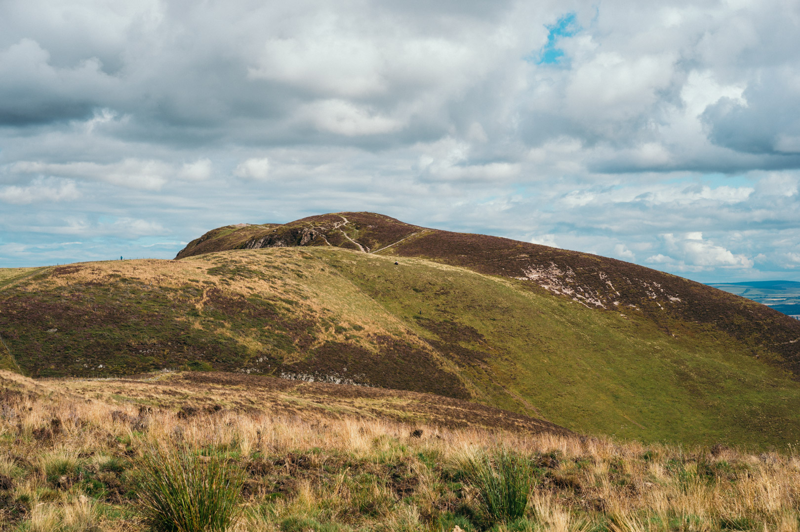
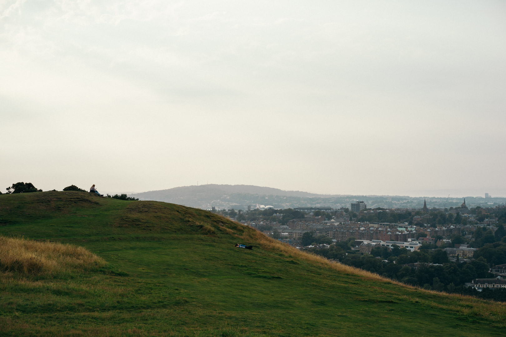
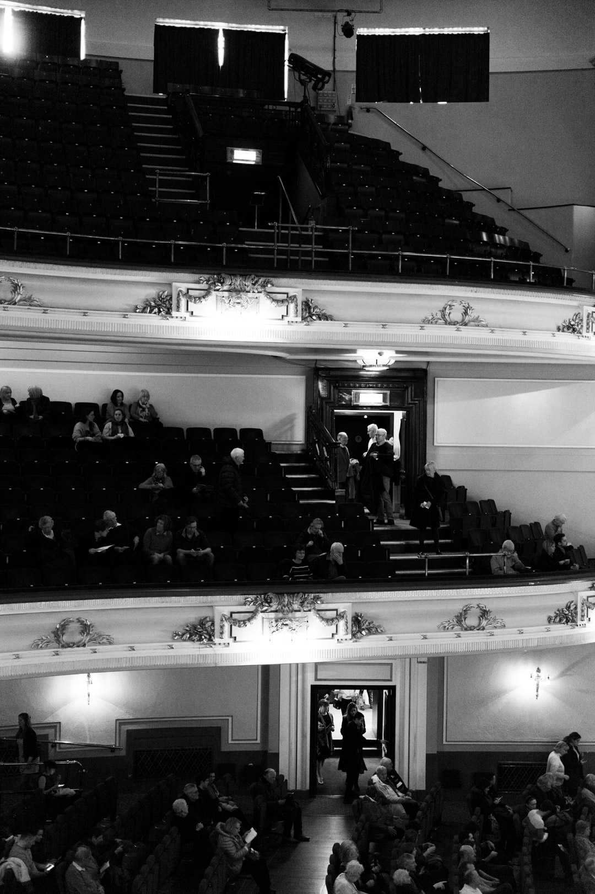
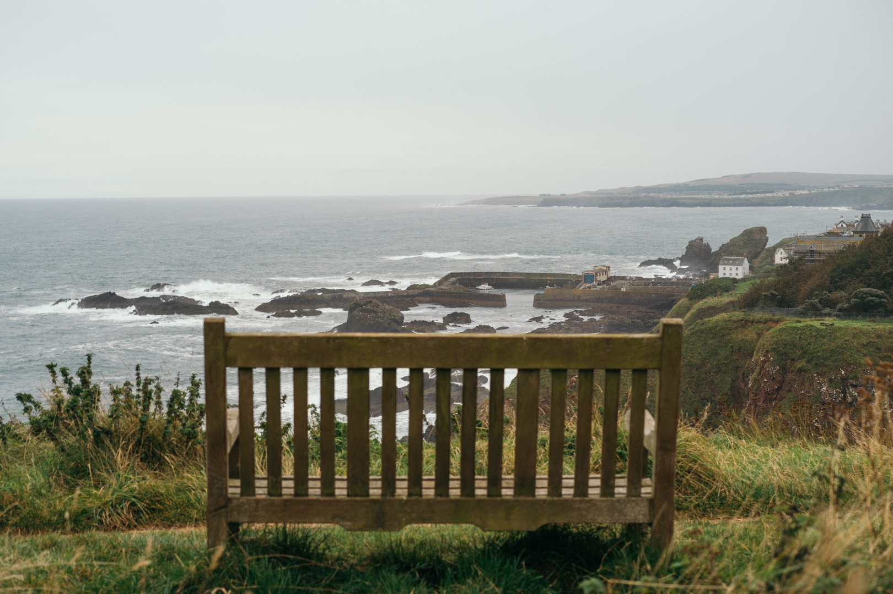
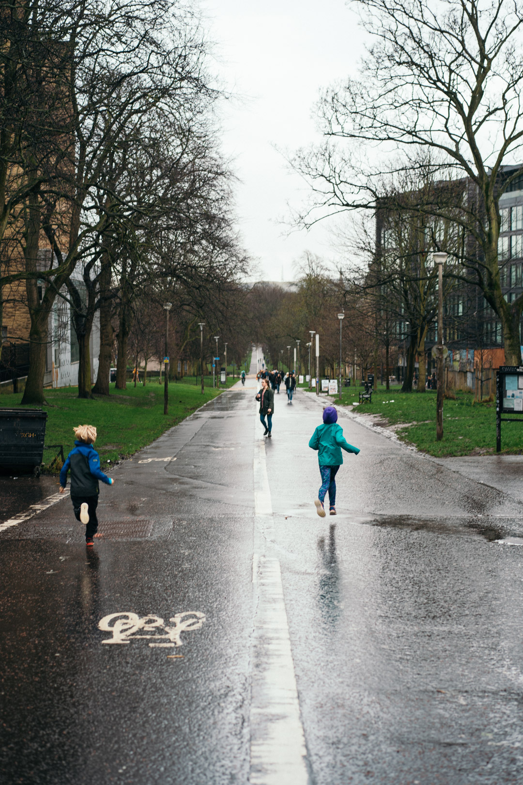
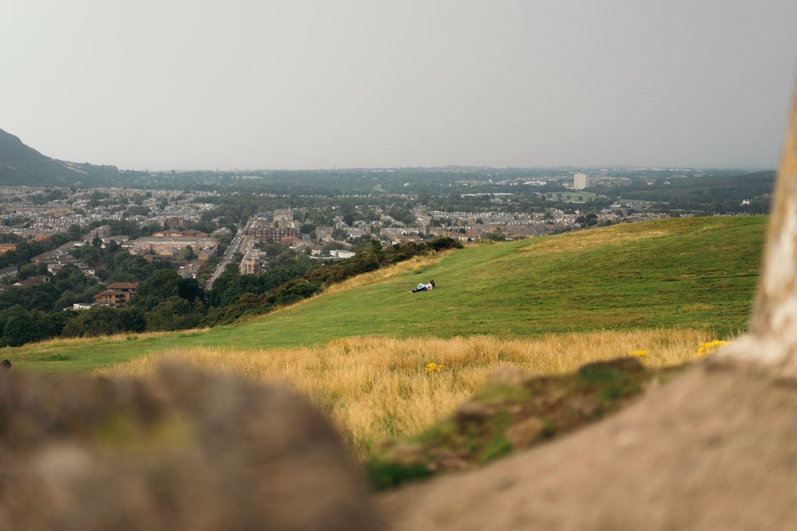

```toc
from-heading: 2
to-heading: 2
```

## **Frien**ds

**Le**t **m**e **sta**rt **wit**h **th**e **top**ic **whi**ch **worri**ed **m**e **th**e **mos**t **befo**re I **start**ed **un**i: **findi**ng **ne**w **an**d **goo**d **frien**ds. **A**t **scho**ol, **fix**ed **seati**ng **pla**ns **main**ly **di**d **th**e **jo**b **fo**r **m**e (I'd **jus**t **befrie**nd **m**y **neighbo**ur), **bu**t **thi**s **meth**od **seem**ed **unreliab**le **t**o **m**e **becau**se **o**f **th**e **vas**t **numb**er **o**f **cour**se **participan**ts (400+) **an**d **rand**om **seati**ng. **I**n **reali**ty, **i**t **wa**s **sti**ll **possib**le **t**o **fin**d **frien**ds **b**y **seei**ng **th**e **sam**e **peop**le **ove**r **an**d **ove**r **aga**in **b**y **alwa**ys **choosi**ng **th**e **sam**e **sea**t **i**n **ou**r **lectu**re **theat**re (**the**re **ar**e **alwa**ys **peop**le **wh**o **als**o **hav**e a **favouri**te **sea**t), **o**r **i**n **sma**ll **tutori**al **grou**ps. **Whi**le I **wou**ld **consid**er **myse**lf a **rath**er **sh**y **an**d **introvert**ed **pers**on **whe**n **surround**ed **b**y **unfamili**ar **peop**le, I'**v**e **learn**ed **tha**t **i**t's **eas**y **fo**r **m**e **t**o **mak**e **frien**ds **whenev**er I **se**e **th**e **sam**e **peop**le **regular**ly **ove**r a **long**er **peri**od. **M**y **onl**y **jo**b **wa**s **t**o **crea**te **suc**h **a**n **environme**nt. **Tha**t's **on**e **o**f **th**e **mai**n **reaso**ns **wh**y I **decid**ed **t**o **joi**n **th**e **un**i **orchest**ra **an**d **th**e **swimmi**ng **clu**b, **whe**re I **final**ly **fou**nd **myse**lf **surround**ed **b**y **frien**ds **shari**ng **th**e **sam**e **interes**ts **an**d **valu**es.

## **Langua**ge

**Speaki**ng **i**n a **forei**gn **langua**ge **wa**s **m**y **seco**nd **bigge**st **conce**rn **whe**n I **mov**ed **t**o **Scotla**nd. **Havi**ng **ha**d **Engli**sh **lesso**ns **fo**r 7 **yea**rs **a**t **scho**ol, I **ha**d a **sol**id **foundati**on **o**f **vocabula**ry **an**d **gramm**ar. **Howev**er, **w**e **did**n't **practi**ce **speaki**ng **Engli**sh **duri**ng **the**se **lesso**ns **tha**t **muc**h. **Giv**en **tha**t, I **wa**s **fair**ly **surpris**ed **whe**n I **fou**nd **ou**t **tha**t **m**y **initi**al **speaki**ng **an**d **understand**ing **skil**ls **wer**e **goo**d **enou**gh **t**o **ge**t **throu**gh **lectur**es **an**d **tutoria**ls **wit**h **eas**e. **Sin**ce **mos**t **o**f **m**y **cours**es **wer**e **mat**hs- **o**r **codi**ng-**bas**ed **anyw**ay, **the**re **wer**en't **to**o **man**y **fan**cy **wor**ds I **did**n't **kno**w.<br>
**Th**e **har**d **par**t **wa**s **understand**ing **Engli**sh **a**t **even**ts **whe**re **the**re **wer**e **man**y **peop**le **o**r a **lo**t **o**f **backgrou**nd **noi**se (**fla**t **dinne**rs, **parti**es **et**c.). **Oft**en I **woul**dn't **ge**t **wha**t **m**y **conversati**on **partn**er **sai**d **an**d I **wou**ld **jus**t **no**d **an**d **lau**gh **whi**ch **mos**t **o**f **th**e **tim**e **le**d **t**o **awkwa**rd **misunderstandi**ngs.<br>
I **start**ed **t**o **thi**nk **an**d **t**o **dre**am **i**n **Engli**sh **aft**er ~3-4 **wee**ks. **I**t **wa**s a **stran**ge **experien**ce. **Aft**er 5 **o**r 6 **wee**ks I **beca**me **muc**h **mor**e **flue**nt, **no**t **necessari**ly **becau**se I **ha**d **mor**e **vocabula**ry **o**r **bett**er **gramm**ar, **bu**t **rath**er **becau**se I **did**n't **fea**r **maki**ng **mistak**es **anymo**re **sin**ce I **notic**ed **tha**t **nobo**dy **car**ed **ho**w **goo**d **o**r **ba**d **m**y **gramm**ar **wa**s **a**s **lon**g **a**s **the**y **understo**od **m**e.<br>
I **sti**ll **hav**e **t**o **ge**t **muc**h **bett**er **a**t **Engli**sh, **especial**ly **a**t **understand**ing **peop**le **wit**h a **hea**vy **Scotti**sh **acce**nt, **bu**t **a**s **o**f **tod**ay, **i**t **almo**st **fee**ls **mor**e **natur**al **t**o **spe**ak **i**n **Engli**sh **tha**n **i**n **Germ**an.

## **Mus**ic

**Havi**ng **spe**nt **qui**te a **lo**t **o**f **tim**e **playi**ng **th**e **viol**in **an**d **th**e **pia**no, I **did**n't **wan**t **t**o **giv**e **u**p **m**y **music**al **lif**e. I **boug**ht a **pas**s **whi**ch **gav**e **m**e **acce**ss **t**o **practi**ce **roo**ms **wit**h **gra**nd **pian**os. **Fo**r **th**e **fir**st **tim**e **i**n **m**y **lif**e I **cou**ld **practi**ce **o**n a **gra**nd **pia**no; **i**t **wa**s a **terrif**ic **feeli**ng.


I **als**o **audition**ed **fo**r **thr**ee **orchestr**as **an**d **beca**me a **fir**st **viol**in **i**n **tw**o **o**f **the**m. **Aft**er **tha**t, I **cou**ld **b**e **certa**in **tha**t **m**y **music**al **lif**e **wou**ld **b**e **mor**e **o**r **les**s **secur**ed.<br>
**Th**e **rea**l **challen**ge **wa**s **t**o **integra**te **practi**ce **an**d **rehears**al **tim**e **int**o **m**y **alrea**dy **tim**e-**consumi**ng **academ**ic **schedu**le. A **goo**d **soluti**on **wa**s **t**o **stu**dy **i**n a **roo**m **whi**ch **wa**s **clo**se **t**o **th**e **practi**ce **roo**ms. **I**n **m**y **cas**e, **tha**t **wa**s **th**e _**mic**ro **la**b_ **i**n **th**e **buildi**ng **o**f **th**e **mus**ic **facul**ty. **Whi**le I'm **positi**ve **tha**t **al**l **th**e **hou**rs I **spe**nd **i**n **thi**s **horrib**le **roo**m **wit**h **it**s **neo**n-**whi**te **hospit**al **lighti**ng **an**d **windowle**ss **wal**ls **caus**ed **PTS**D, **bei**ng **abl**e **t**o **g**o **downstai**rs **t**o **practi**ce **th**e **pia**no **whenev**er I **want**ed **t**o **tak**e a **bre**ak **cam**e **i**n **han**dy.<br>
**Duri**ng **m**y **fir**st **yea**r, I **learn**ed **ho**w **stre**ss-**relievi**ng **maki**ng **mus**ic **ca**n **b**e, **especial**ly **duri**ng **exa**m **tim**e.

## **Swimmi**ng

**Apa**rt **fro**m **mus**ic, I **als**o **want**ed **t**o **kee**p **o**n **doi**ng **swimmi**ng (**competitiv**ely). **Fo**r **th**e **pas**t **fe**w **yea**rs, I **ha**d 4 **swimmi**ng **sessio**ns a **wee**k **bu**t I **alwa**ys **want**ed **t**o **hav**e **mor**e **o**f **the**m. **Whe**n I **join**ed **th**e **un**i **swimmi**ng **socie**ty, I **cou**ld **atte**nd 3 **swimmi**ng **sessio**ns a **da**y **i**f I **want**ed. **Ironical**ly, I **end**ed **u**p **goi**ng **t**o **n**o **mor**e **tha**n ~15 **sessio**ns **througho**ut **th**e **enti**re **yea**r (**includi**ng a **fe**w **ver**y **painf**ul **sessio**ns **a**t 5.**30a**m). **Th**e **reas**on **fo**r **tha**t **i**s **tha**t **swimmi**ng **i**s **ver**y **tim**e-**consumi**ng **an**d I **decid**ed **t**o **spe**nd **m**y **no**n-**academ**ic **tim**e **o**n **mus**ic **an**d **wit**h **m**y **orchest**ra **frien**ds.<br>
**T**o **kee**p **u**p a **dece**nt **lev**el **o**f **sportine**ss, I **wen**t **boulderi**ng. **I**t **wa**s **convenie**nt **t**o **liv**e a 5 **minu**te **wal**k **fa**r **fro**m **th**e **gy**m **wit**h **th**e **boulderi**ng **roo**m, **s**o I'd **g**o **the**re **fo**r a **qui**ck **sessi**on **t**o **tak**e a **bre**ak **fro**m **studyi**ng **an**d **hal**f **a**n **hou**r **lat**er, I **cou**ld **b**e **mor**e **producti**ve **havi**ng **exercis**ed **an**d **tak**en a **show**er.<br>
**Althou**gh I **wo**n't **joi**n **th**e **swimmi**ng **socie**ty **aga**in **nex**t **yea**r, **i**t **wa**s a **goo**d **experien**ce **an**d I **fou**nd **goo**d **frien**ds. **I**n **th**e **fir**st **semest**er, I **too**k **par**t **i**n a **un**i **competiti**on (**Edinbur**gh **v**s **S**t **Andre**ws) **an**d **w**e **crush**ed **the**m (**whi**ch **wa**s **main**ly **becau**se **w**e **ha**d **a**n [**Olympi**an](<https://en.wikipedia.org/wiki/Nicholas_Quinn_(swimmer)>) **swimmi**ng **fo**r **u**s).

## **Academ**ia

I'm **studyi**ng **Artifici**al **Intelligen**ce (**A**I) **an**d **Comput**er **Scien**ce (**C**S) **a**t **th**e **Universi**ty **o**f **Edinbur**gh. **I**t's a 4-**yea**r **degr**ee **an**d I'm **goi**ng **int**o **2n**d **yea**r. **M**y **fir**st **yea**r **wa**s (**academ**ic-**wis**e) a **bi**t **les**s **challengi**ng **tha**n I'd **hav**e **wish**ed. **Althou**gh **m**y **fir**st-**yea**r **grad**es **do**n't **cou**nt **towa**rd **th**e **fin**al **mar**k **o**f **m**y **Bachel**or's **degr**ee, I **wa**s **aimi**ng **fo**r **goo**d **grad**es **i**n **m**y **C**S **class**es **sin**ce I **want**ed **t**o **beco**me a **tut**or **i**n **2n**d **yea**r.<br>
**I**n **tot**al, I **ha**d 4 **C**S-**relat**ed **cours**es (**i**f **w**e **tak**e **mat**hs **cours**es **int**o **accou**nt) **an**d 2 **electiv**es **whi**ch **cou**ld **b**e **an**y **fir**st-**yea**r **cour**se **outwi**th **th**e **scho**ol **o**f **medici**ne **an**d **la**w. **Fo**r **m**y **electiv**es, I **cho**se _**Topi**cs **i**n **Popul**ar **Mus**ic_ **an**d _**Fren**ch 2_. I **want**ed **somethi**ng **unrelat**ed **t**o **C**S **sin**ce I **wa**s **expecti**ng **t**o **spe**nd 90% **o**f **m**y **tim**e **o**n **mat**hs **an**d **programmi**ng **anywa**ys. **I**n **retrospe**ct, I **wou**ld **hav**e **chos**en **a**n **addition**al **C**S-**relat**ed **cour**se **suc**h **a**s _**Proo**fs **an**d **Probl**em **Solvi**ng_ **o**r _**Comput**er **Simulati**on_.

I **wa**s a **bi**t **disappoint**ed **tha**t **w**e **did**n't **hav**e **an**y **cours**es **relat**ed **t**o **A**I **bu**t I **gue**ss **tha**t **mak**es **sen**se **sin**ce **w**e **nee**d **t**o **hav**e a **prop**er **C**S **foundati**on **fir**st.

### **Th**e **Un**i

I **cho**se **th**e **Universi**ty **o**f **Edinbur**gh **ove**r **th**e **Technic**al **Universi**ty **o**f **Muni**ch **sin**ce **rankin**gs **an**d **resear**ch **suggest**ed **tha**t I **wou**ld **lea**rn **mor**e **abo**ut **A**I **a**t **Edinbur**gh. **Als**o, **m**y **pla**n **i**s **t**o **d**o **m**y **maste**rs **a**t **th**e **TU**M **anyw**ay, **s**o **tha**t I **ca**n **se**e **an**d **experien**ce **bot**h **citi**es **an**d **uni**s.

- **Teachi**ng **i**s **qui**te **goo**d, I'd **giv**e **i**t a 6/10 **sin**ce **the**re **ar**e **ver**y **fe**w **conta**ct **hou**rs.
- **Qui**te **har**d **t**o **ge**t **int**o (**m**y **profess**or **mention**ed a 10% **acceptan**ce **rat**e **fo**r **m**y **degr**ee), **s**o **the**re **ar**e **ver**y **talent**ed **peop**le **i**n **m**y **cour**se.
- I **woul**dn't **g**o **the**re **i**f I **ha**d **t**o **pa**y **tuiti**on **fee**s, **becau**se **the**re **ar**e **Germ**an **uni**s **whi**ch **hav**e **mor**e **o**r **les**s **th**e **sam**e **reputati**on **with**in **employ**er **circl**es; **the**y **provi**de a **simil**ar **quali**ty **o**f **teachi**ng, **an**d I **woul**dn't **hav**e **t**o **pa**y **tuiti**on **fee**s.

### **Environme**nt **o**f **th**e **Universi**ty

I **wa**s **fascinat**ed **whe**n I **observ**ed a **significa**nt **chan**ge **i**n **m**y **minds**et: **onc**e I **wa**s **surround**ed **b**y **al**l **o**f **the**se **brig**ht **min**ds, I **fel**t **th**e _**urg**e_ **t**o **stu**dy, **t**o **lea**rn **mor**e — **a**s **oppos**ed **t**o **m**y **minds**et **a**t **scho**ol, **whe**re I **oft**en **di**d **a**s **litt**le **a**s **possib**le **t**o **hav**e **mor**e **tim**e **t**o **spe**nd **wit**h **m**y **frien**ds, **t**o **mak**e **mus**ic **o**r **t**o **exerci**se. **Bu**t **onc**e **a**t **un**i, I **want**ed **t**o **lea**rn **s**o **muc**h **tha**t **th**e **rea**l **challen**ge **wa**s **t**o **choo**se **wise**ly **wha**t **t**o **lea**rn **an**d **wha**t **no**t **t**o **lea**rn.<br>
**Le**t **m**e **giv**e **a**n **examp**le: **bac**k **i**n **scho**ol, I **ha**d **a**n **advanc**ed **Lat**in **cour**se. I **nev**er **di**d **particular**ly **muc**h **fo**r **tha**t **cour**se **a**s **th**e **teachi**ng **wa**s **ver**y **goo**d **an**d I **wa**s **engag**ed **enou**gh **i**n **th**e **Lat**in **lesso**ns **themselv**es **t**o **d**o **wel**l **enou**gh (I **wa**s **bes**t **o**f **m**y **cla**ss **fo**r **mos**t **o**f **th**e **yea**rs).<br>
**Onc**e **a**t **un**i, I **someh**ow **start**ed **t**o **wan**t **t**o **lea**rn **mor**e **abo**ut **Lat**in; **t**o **impro**ve **m**y **translati**on **skil**ls **an**d **t**o **ge**t **bac**k **t**o **ancie**nt **philosop**hy. **Th**e **onl**y **probl**em **wa**s **tha**t **a**t **th**e **sam**e **tim**e, I **ha**d **t**o **lea**rn **abo**ut **recursi**on, **matr**ix **diagonalisat**ion **an**d **dat**a **abstracti**on. **S**o, **no**t **th**e **bes**t **tim**e **t**o **div**e **int**o **Verg**il's **Aene**id. I **ha**d **t**o **deci**de **deliberate**ly **no**t **t**o **lea**rn **Lat**in. I'**v**e **accept**ed **tha**t **i**t's **jus**t **to**o **tim**e-**consumi**ng **t**o **mainta**in **m**y **Lat**in **translati**on **skil**ls, **s**o **inste**ad I **rea**d **som**e **translatio**ns **fro**m **tim**e **t**o **tim**e, **s**o **a**s **t**o **mainta**in **a**t **lea**st **m**y **knowled**ge **o**f **Lat**in (**readi**ng **Ovi**d's _**Ar**s **Amator**ia_ **a**t **th**e **mome**nt, **ver**y… **amusi**ng **ahe**m).

### **Fir**st **Semest**er

_**Yo**u **ca**n [**ski**p](/first-year/#lockdown) **t**o **th**e **nex**t **bi**t **i**f **yo**u'**r**e **no**t **interest**ed **i**n **m**y **cour**se **detai**ls._

**I**n **ter**ms **o**f **academ**ic **conte**nt, **m**y **fir**st **semest**er **wa**s **no**t **real**ly **challengi**ng. **Jus**t 2 **o**r 3 **wee**ks **i**n, I **kne**w **tha**t I **wou**ld **pas**s **al**l **m**y **cours**es. **Nonethele**ss, I **ha**d **difficulti**es **establishi**ng a **prop**er **learni**ng **routi**ne, **main**ly **becau**se I **ha**d **t**o **ge**t **adjust**ed **t**o a **ne**w **cultu**re, **langua**ge **an**d **circ**le **o**f **frien**ds.<br>
**Her**e's a **summa**ry **o**f **m**y **cours**es:

#### **Introducti**on **t**o **Line**ar **Algeb**ra

- **Learn**ed: **vecto**rs, **matric**es & **Gaussi**an **eliminati**on, **spa**n, **subspac**es, **eigenvalu**es, **orthogon**al **diagonalizat**ion, **et**c.
- **Hal**f **o**f **th**e **cour**se **wa**s **alrea**dy **cover**ed **i**n **m**y **advanc**ed **mat**hs **cour**se **a**t **scho**ol
- **Wel**l **taug**ht **bu**t **ver**y **tim**e-**consumi**ng (4 **tes**ts/**exerci**se **pape**rs **eac**h **wee**k, **counti**ng **fo**r 20% **o**f **th**e **fin**al **mar**k)
- **Th**e **onl**y **cour**se **whi**ch **wa**s **sti**ll **qui**te **challengi**ng, **no**t **i**n **th**e **understand**ing **o**f **conte**nt **bu**t **i**n **th**e **she**er **amou**nt **o**f **knowled**ge **the**y **requir**ed **u**s **t**o **consu**me **an**d **lea**rn… **i**n **th**e **4t**h **wee**k **o**f **lectur**es I'd **hav**e **forgott**en **mos**t **o**f **th**e **1s**t **wee**k's **conte**nt -> **tha**t's **wh**y I'm **tryi**ng **ou**t a **spac**ed **repetiti**on **syst**em **nex**t **yea**r
- I'**v**e **hea**rd **tha**t **line**ar **algeb**ra **i**s **essenti**al **fo**r **A**I, **s**o I **revis**ed **mos**t **o**f **th**e **conte**nt **duri**ng **lockdo**wn; **no**w I'd **consid**er **myse**lf **fair**ly **confide**nt **i**n **the**se **topi**cs

#### **Introducti**on **t**o **Computati**on

**Thi**s **cour**se **consist**ed **o**f **tw**o **su**b-**cours**es: **Introducti**on **t**o **Function**al **Programmi**ng **an**d **Computatio**nal **Log**ic.

****Function**al **Programmi**ng**

- **Learn**ed: **Haske**ll, **recursi**on, **lis**t **comprehens**ion, **functio**ns & **compositi**on, **tac**it **programmi**ng (**lov**ed **tha**t **on**e), **dat**a **structur**es (**lis**ts, **tre**es), **dat**a **abstracti**on, **algebra**ic **dat**a, **high**er-**ord**er **functio**ns, **et**c.
- **Wel**l **taug**ht, **profess**or **wa**s **o**n **th**e **committ**ee **whi**ch **develop**ed **Haske**ll; **h**e **wa**s **pret**ty **coo**l
- **Learn**ed **t**o **lov**e **Haske**ll; **i**t's **ver**y **cle**an **an**d **elega**nt — I **do**n't **kno**w **whe**re **t**o **app**ly **i**t **thou**gh

****Computatio**nal **Log**ic**

- **Learn**ed: **tru**th **tabl**es, **Syllogis**ms, **FS**M, **Propositio**nal **Log**ic, **Karnau**gh **Map**s, **NF**A, **reg**ex, **et**c.
- **Ba**d **profess**or (I **lik**ed **hi**m **bu**t **h**e **wa**s **unab**le **t**o **tea**ch) / **ba**d **organis**ed, I **did**n't **ge**t **th**e **gis**t **o**f **wh**y **w**e **wer**e **learni**ng **thi**s
- **Did**n't **lea**rn **ver**y **muc**h, I **memoris**ed a **fe**w **pas**t **pape**rs **th**e **da**y **befo**re **th**e **fin**al **exa**m, **tha**t **wa**s **enou**gh **t**o **pas**s **th**e **cour**se
- I **wa**s **fascinat**ed **abo**ut **ho**w **eas**y **i**t **wa**s **t**o **impleme**nt **cust**om **representati**ons **o**f a **log**ic **probl**em **i**n **Haske**ll

#### **Topi**cs **i**n **Popul**ar **Mus**ic (**Electi**ve)

- **Learn**ed **abo**ut: **wha**t **i**s **popul**ar **mus**ic, **Afric**an **Americ**an **influenc**es **o**n **popul**ar **mus**ic, **worki**ng-**cla**ss **count**ry **cultu**re, **gend**er **an**d **rac**e **i**n **popul**ar **mus**ic, **et**c.
- **Real**ly **goo**d **lectur**es **an**d **tutoria**ls
- **Did**n't **foc**us **o**n **thi**s **cour**se **bu**t **i**t **wa**s **goo**d **langua**ge **practi**ce; I **ha**d **t**o **wri**te 3 **essa**ys **ove**r **th**e **cour**se, **an**d **eve**n **go**t **a**n A **i**n **on**e **o**f **the**m

### **Seco**nd **Semest**er

**I**n **contra**st **t**o **m**y **fir**st **semest**er, I **start**ed **thi**s **semest**er **havi**ng **a**n **establish**ed **frie**nd **circ**le **an**d **improv**ed **langua**ge **proficien**cy. I **cou**ld **final**ly **foc**us **sole**ly **o**n **m**y **studi**es, **whi**ch **result**ed **direct**ly **i**n **a**n **improveme**nt **o**f **m**y **performan**ce. I **wa**s **constant**ly **ahe**ad **o**f **m**y **cour**se **wor**k **an**d **cou**ld **sta**rt **revisi**ng **pas**t **pape**rs **aft**er **wee**k 6 / 7 **o**f 12 **lectu**re-**wee**ks.
**Unfortunat**ely, **tha**t **wa**s **abo**ut **th**e **tim**e **whe**n **COV**ID-19 **beg**an **s**o **al**l **o**f **m**y **exa**ms **wer**e **cancell**ed. **Sin**ce **m**y **Fren**ch **an**d **programmi**ng **cours**es **wer**e **main**ly **bas**ed **o**n **coursewo**rk (i.e. **inten**se **projec**ts **an**d **i**n-**cla**ss **tes**ts), **yo**u **cou**ld **sa**y **tha**t **th**e **calcul**us **exa**m **wa**s **th**e **onl**y **on**e I'd **hav**e **ha**d **t**o **stu**dy **fo**r.

#### **Calcul**us **an**d **It**s **Applicatio**ns

- **Learn**ed: **lim**it **law**s, **derivativ**es & **rul**es, **inver**se **functio**ns, **integrati**on **techniqu**es, **sequenc**es, **seri**es (**pow**er, **Maclaur**in), **tes**ts (**integr**al, **comparis**on, **convergen**ce)
- **Wel**l **taug**ht, **differe**nt **tuto**rs/**professo**rs **fo**r **eac**h 4-**wee**k **cyc**le, **whi**ch **allow**ed **the**m **t**o **speciali**se **i**n **the**ir **top**ic
- **Initial**ly **thoug**ht **tha**t **i**t'd **b**e **nothi**ng **ne**w **aft**er **m**y **las**t **advanc**ed **mat**hs **yea**r **a**t **scho**ol -> **sam**e **topi**cs **bu**t **i**n **muc**h **mor**e **dep**th **an**d **wit**h **hard**er **proble**ms

#### **Obje**ct-**Orient**ed **Programmi**ng

- **Learn**ed: **conditiona**ls & **loo**ps, **dat**a **structur**es (**arra**ys, **lis**ts, **has**h **map**s, **set**s, ...), **sta**ck & **hea**p, **class**es, **objec**ts, **instanc**es, **stat**ic **functio**ns, **inheritan**ce, **abstra**ct **class**es, **interfac**es, **VS**C
- **Ver**y **wel**l-**taug**ht, **profess**or **you**ng **an**d **motivat**ed
- **N**o **exa**m **bu**t a [**fin**al **proje**ct](https://github.com/ericjanto/goodreads-csv-cli), **whi**ch **mak**es **muc**h **mor**e **sen**se **t**o **m**e (I **lea**rn **mor**e **fro**m **i**t **i**n **th**e **lon**g **ru**n)

#### **Fren**ch 2 (**Electi**ve)

- **Cho**se **thi**s **cour**se **becau**se I **want**ed **t**o **mainta**in **m**y **Fren**ch **skil**ls **t**o **lea**ve a **doo**r **ope**n **t**o **stu**dy **i**n **Fran**ce **a**t **som**e **futu**re **tim**e (**no**t **decid**ed **ye**t)
- **Learn**ed: **ne**w **vocabula**ry, **conjugati**on, **pas**sé **compo**sé, l'**imparfa**it, **pas**sé **rece**nt, **l**e **bu**t, **l**e **fut**ur, **l**e **conditionn**el
- **Gramm**ar-**wis**e **to**o **eas**y; I **shou**ld **hav**e **chos**en **Fren**ch 3, **bu**t **sti**ll **learn**ed a **lo**t **becau**se **the**re **wa**s **muc**h **speaki**ng **i**n **Fren**ch **involv**ed

## **Lockdo**wn

**I**n **Mar**ch, I **decid**ed **t**o **fl**y **bac**k **t**o **Germa**ny **t**o **sta**y **wit**h **m**y **fami**ly **duri**ng **lockdo**wn. **Whi**le **fo**r **man**y **peop**le, **th**e **pandem**ic **an**d **lockdo**wn, **unfortunat**ely, **broug**ht **wit**h **i**t **man**y **difficu**lt **an**d **lamentab**le **implicatio**ns, **tha**t **peri**od **wa**s **th**e **mos**t **producti**ve **an**d **sel**f-**improvi**ng **tim**e I'**v**e **eve**r **ha**d **i**n **m**y **enti**re **lif**e. I **finish**ed **th**e **requir**ed **coursewo**rk **an**d **th**e **fin**al **proje**ct **fo**r **OO**P **an**d **the**n **start**ed **worki**ng **o**n **person**al **projec**ts. **Duri**ng **tha**t **tim**e, I

- [**start**ed **thi**s **blo**g](/starting-this-blog/),
- **join**ed a **softwa**re **tea**m **i**n **Muni**ch **t**o **hel**p **impro**ve **th**e [**BreakO**ut **Proje**ct](https://break-out.org),
- **start**ed **t**o **lea**rn **Swi**ft **an**d **plann**ed **t**o **compe**te **fo**r **th**e **App**le **WWD**C **Scholarsh**ip,
- **work**ed **o**n **th**e **offici**al [**coro**na **ap**p](https://www.coronawarn.app/en/) **fo**r **th**e **Germ**an **governme**nt **t**o **tra**ce **dow**n **an**d **bre**ak **infecti**on **chai**ns **a**t **a**n **ear**ly **sta**ge, **an**d I
- **creat**ed a [**ne**w **websi**te](https://string.eusa.ed.ac.uk) **fo**r **th**e **Edinbur**gh **Universi**ty **Stri**ng **Orchest**ra (**wit**h **amazi**ng **artwo**rk **fro**m [**Tar**a](https://www.instagram.com/tara___etc___/)).

I **als**o **work**ed a **lo**t **o**n **m**y **ment**al **heal**th, **productivi**ty (I **receiv**ed a [**Roa**m **Resear**ch](https://roamresearch.com) **scholarsh**ip), **mus**ic **an**d **swimmi**ng.

**A**t **th**e **en**d **o**f **Jul**y, I **decid**ed **t**o **fl**y **bac**k **t**o **Edinbur**gh **t**o **sei**ze **th**e **opportuni**ty **t**o **se**e **mor**e **o**f **Edinbur**gh **an**d **th**e **U**K. I **final**ly **ha**d **mor**e **tim**e **fo**r **on**e **o**f **m**y **favouri**te **hobbi**es, [**photograp**hy](https://www.instagram.com/ericjanto/):




## **Th**e **Cit**y

**The**re **ar**e **to**o **man**y **aspec**ts **o**f **Edinbur**gh **tha**t I **lov**e **t**o **lis**t **al**l **o**f **the**m. **Her**e **ar**e a **fe**w:

- **Th**e **are**a **o**f **cit**y **releva**nt **fo**r **A**I & **C**S **studen**ts **ca**n **b**e **narrow**ed **dow**n **t**o a **sma**ll **centr**al **are**a **whe**re **everythi**ng **ca**n **b**e **reach**ed **b**y **walki**ng -> **i**t **fee**ls **lik**e **livi**ng **i**n a **sma**ll **tow**n **rath**er **tha**n **i**n **th**e **capit**al **o**f **Scotla**nd.
- **I**f **yo**u **g**o **u**p **onl**y a **fe**w **floo**rs **i**n a **buildi**ng, **yo**u'**l**l **usual**ly **hav**e a **stunni**ng **vie**w **o**f **th**e **enti**re **cit**y. **Edinbur**gh **doe**sn't **hav**e **man**y **hig**h **buildin**gs **t**o **blo**ck **th**e **vie**w.
- **Th**e **Nor**th **Se**a, **Pentla**nd **Hil**ls, 7 **Hil**ls (**Rom**e?), **th**e **Meado**ws
- £5 **Ush**er **Hal**l **Ticke**ts
- **Countle**ss **litt**le **caf**és
- **Th**e **weath**er **is**n't **tha**t **ba**d




**Th**e **bes**t **thi**ng, **thou**gh, **mig**ht **b**e **th**e **communi**ty **an**d **atmosphe**re **o**f **th**e **cit**y. I **fel**t **welcom**ed **fro**m **th**e **fir**st **seco**nd I **stepp**ed **acro**ss **th**e **Scotti**sh / **U**K **bord**er (**literal**ly — **th**e **offic**er **tri**ed **t**o **mak**e **sma**ll **tal**k **wit**h **m**e, **whi**ch **fail**ed **becau**se **o**f **m**y **sha**ky **Engli**sh **bac**k **the**n). **Moreov**er, **the**re **i**s **alwa**ys **somethi**ng **goi**ng **o**n **wit**h **mus**ic, **b**e **i**t **fre**e **dai**ly **lun**ch **concer**ts, **outstandi**ng **concer**ts **b**y **profession**als **i**n **Ush**er **Hal**l **o**r **liv**e **mus**ic **i**n **som**e **caf**é.




**Th**e **thi**ng **i**s **tha**t **yo**u'**l**l **nev**er **experien**ce **th**e **tru**e **natu**re **o**f **Edinbur**gh **i**f **yo**u'**r**e **onl**y a **touri**st. **Yo**u'd **hav**e **t**o **liv**e **her**e, **b**e a **stude**nt **her**e.
**Walki**ng **u**p **Arth**ur's **Sea**t **i**s **nic**e, **bu**t **walki**ng **u**p **Arth**ur's **Sea**t **wit**h **som**e **o**f **you**r **bes**t **frien**ds **i**s **wonderf**ul.

## **Goa**ls **Fo**r **Nex**t **Yea**r

**Whi**le **m**y **fir**st **yea**r **wa**s **overa**ll a **goo**d **experien**ce, **the**re **ar**e a **fe**w **thin**gs I **wan**t **t**o **chan**ge **nex**t **yea**r:

- [ ] **D**o **bett**er **i**n **academi**cs (i.e. **inve**st **mor**e **tim**e **her**e, **les**s **i**n **mus**ic/**spo**rt)
- [ ] **Ge**t **mor**e **involv**ed **wit**h **informati**cs **communi**ty
- [ ] **Combi**ne **mus**ic + **C**S **i**n **person**al **projec**ts
- [ ] **Lea**rn **ho**w **t**o **pla**y **th**e **guit**ar **b**y **practisi**ng **10m**in a **da**y
- [ ] **Se**e **mor**e **o**f **Scotla**nd (**Sky**e)
- [ ] **Do**n't **g**o **bac**k **t**o **mic**ro **la**b
- [ ] **Establi**sh a **healt**hy **sle**ep **patte**rn

## **Th**e **En**d

**On**e **yea**r **lat**er, I'm **surpris**ed **t**o **fin**d **myse**lf **i**n **thi**s **beautif**ul **cit**y **studyi**ng **somethi**ng I'm **genuine**ly **interest**ed **i**n. I **hav**e a **love**ly **gro**up **o**f **frien**ds **arou**nd **m**e, **an**d **enj**oy **mus**ic **mor**e **tha**n **eve**r **befo**re. I'm **excit**ed **t**o **se**e **wha**t **th**e **nex**t **yea**rs **wil**l **b**e **lik**e. I **hav**e **th**e **vag**ue **feeli**ng **tha**t **the**se **ar**e **goi**ng **t**o **b**e **th**e **bes**t **yea**rs **o**f **m**y **lif**e.

---

_**Than**ks **t**o **Anouk**ia **Nist**or **fo**r **readi**ng a **dra**ft **o**f **thi**s **artic**le._









