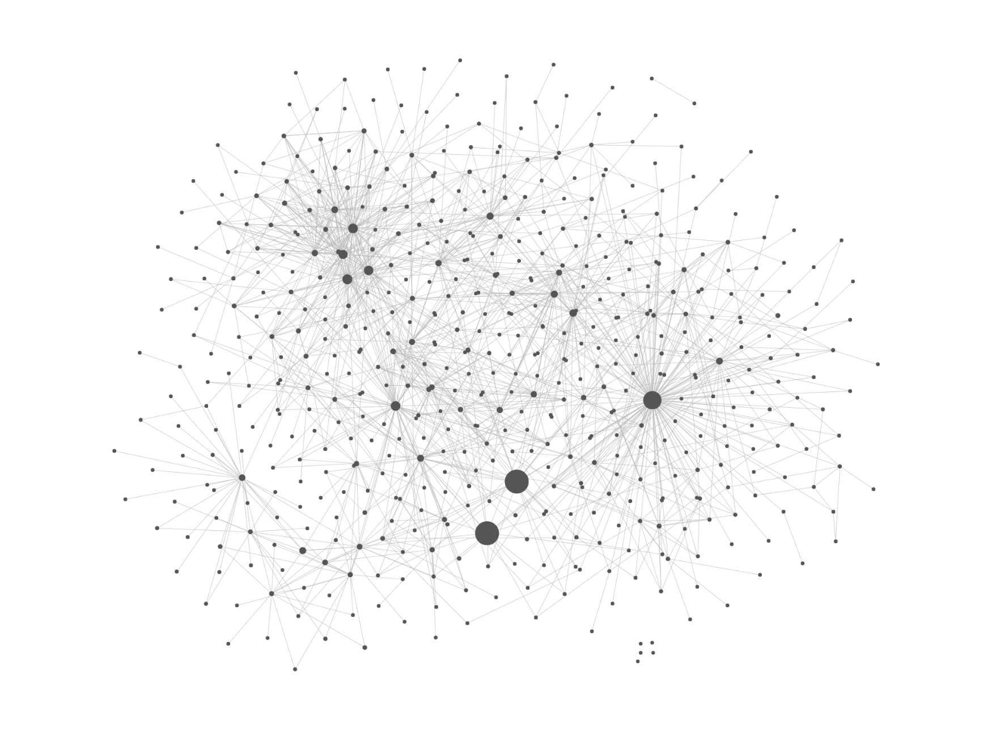
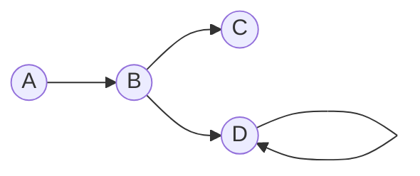
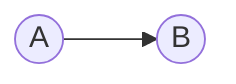
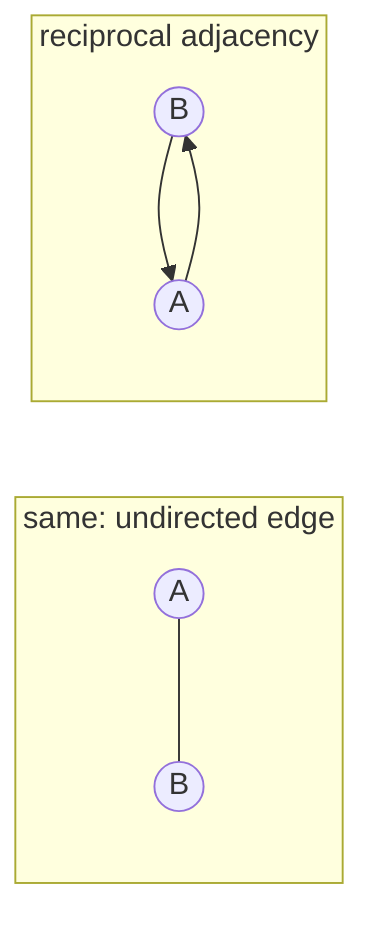
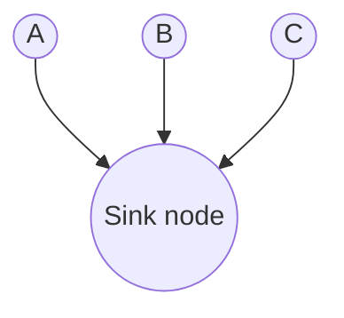
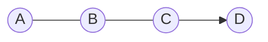
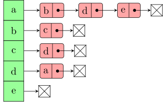

_**Som**e **visualisati**ons **o**r **graphi**cs **i**n **thi**s **artic**le **mig**ht **b**e **difficu**lt **t**o **se**e **o**n **th**e **bla**ck **backgrou**nd, **m**y **apologi**es. I **hav**e **ye**t **t**o **fin**d **th**e **tim**e **t**o **recolo**ur **the**m._



**Her**e's **wha**t I'm **goi**ng **t**o **cov**er **i**n **thi**s **artic**le:

```toc
exclude: [Prerequisites, Goals]
from-heading: 1
to-heading: 2
```

## **Prerequisi**tes

- (**Ver**y) **Bas**ic **Se**t **Theo**ry
- **Properti**es **o**f **Relatio**ns (**Symmet**ry)
- **Matric**es
- **Asymptot**ic **Notati**on

## **Goa**ls

- **Understa**nd **gra**ph **theo**ry
- **Bui**ld **foundatio**ns **fo**r ****Understand**ing **Gra**ph **Algorith**ms **I**I: **Travers**al **Algorith**ms** (**no**t **publish**ed **ye**t)

# A **Bi**t **o**f **Gra**ph **Theo**ry

**Le**t's **sta**rt **fro**m **scrat**ch. **Wha**t **i**s a **gra**ph? A **gra**ph **i**s **basical**ly **jus**t a **structu**re **whi**ch **consis**ts **o**f a **bun**ch **o**f **nod**es, **formal**ly **call**ed _**vertic**es_, **an**d a **bun**ch **o**f **lin**es **whi**ch **conne**ct **th**e **vertic**es, **call**ed _**edg**es_.



Here, we have a graph with 4 vertices ($A$, $B$, $C$, and $D$) and 4 edges (the lines between the vertices). If we were really picky, we'd say that there aren't 4 lines but 4 _**arro**ws_. But we'll get to that later. We'll refer to this graph again, so let's call it $F$.

## **Definiti**on **o**f a **Gra**ph

Let's try to formalise this a bit more, and define a graph $G$:

$$
G=(V,E),\ where\ V\ is\ a\ set\ and\ E\sube V\times V.
$$

Ok, what are we saying here? We have a graph $G$ which is defined by a set $V$ of vertices and a set $E$ of edges. We also have some additional information: $E$ is a subset of the [**Cartesi**an **produ**ct](https://en.wikipedia.org/wiki/Cartesian_product) $V\times V$. So by this definition, an edge is just an ordered pair of vertices.

In the example above, $(a,b)$ would be an element of $E$ since there is a line between $a$ and $b$. Similarly, $(a,d)\notin E$.

$V$ and $E$ are sets, so we can write the following:

- $n = |V|$ is the cardinality ('size') of $V$, i.e. the number of vertices
- $m=|E|$ is the cardinality of $E$, i.e. the number of edges

## **Visualisat**ion **o**f a **Gra**ph

**W**e'**v**e **see**n **th**e **visualisat**ion **o**f a **gra**ph **abo**ve. **Vertic**es **ar**e **represent**ed **b**y **labell**ed **circl**es, **an**d **edg**es **ar**e **visualis**ed **usi**ng **lin**es **t**o **conne**ct **th**e **vertic**es. **Not**e **tha**t **w**e **hav**e **tw**o **differe**nt **kin**ds **o**f **edg**es:

- ****direct**ed **edg**e**: **represent**ed **b**y **a**n **arr**ow, **als**o **call**ed _**arc**h_
- ****undirect**ed **edg**e**: **represent**ed **b**y a **pla**in **lin**e

**W**e **us**e _**direct**ed_ edges when we have an edge going from some vertex $u$ to some vertex $v$ but not vice versa:



**W**e **us**e _**undirect**ed_ edges when we have an edge going from $u$ to $v$ and another edge going from $v$ to $u$:



## **Direct**ed **an**d **Undirect**ed **Grap**hs

**W**e **hav**e **tw**o **differe**nt **typ**es **o**f **grap**hs, **direct**ed **an**d **undirect**ed **grap**hs. <mark>A **gra**ph **i**s **undirect**ed **i**f, **an**d **onl**y **i**f, **al**l **o**f **it**s **edg**es **ar**e **undirect**ed.</mark> Otherwise it's directed.
So if a graph has some edge $(a,b)$ (that is, going from vertex $a$ to vertex $b$), it needs to have an edge $(b,a)$ too in order to be undirected. And that must be true for all edges $e\in E$.

From a mathematical perspective, it's fairly easy to distinguish between these two types. To this end, we note that $E$ is a _**bina**ry **relati**on_ **a**s **i**t **i**s a **subs**et **o**f a **Cartesi**an **produ**ct. **Le**t's **als**o **reca**ll **th**e **definiti**on **o**f a _**symmetr**ic_ **relati**on:

> Let $R$ be a relation on a set $A$.
> A relation $R$ is ****symmetr**ic** if, and only if, for every $x,y\in A$, if $xRy$ then $yRx$.

This is just another way of saying that for all pairs $(x,y)$ in $R$, there must also be a complementing pair $(y,x)$. A graph $G=(V,E)$ is undirected if, and only if, $E$ is symmetric.

### **Mor**e **Notati**on **fo**r **Direct**ed **Grap**hs

For directed graphs, we have a bit of additional notation. If we pick some random vertex $v$, where $v\in V$, we can write $in(v)$. This denotes the _**i**n-**degr**ee_ of $v$, that is, the number of incoming edges into $v$.</br>
In a similar manner, we also have $out(v)$, denoting the number of _**outgoi**ng_ edges from $v$.

A **vert**ex **whi**ch **ha**s **onl**y **edg**es **goi**ng **i**n **bu**t **n**o **edg**es **goi**ng **ou**t **i**s **als**o **call**ed a _**sin**k_ _**nod**e_.



## **Mor**e **Gra**ph **Properti**es: **Plan**ar **an**d **Connect**ed

A **gra**ph **i**s _**plan**ar_ **i**f **i**t **i**s **possib**le **t**o **dra**w **th**e **gra**ph (**formal**ly, **t**o **emb**ed **th**e **gra**ph **i**n **th**e **pla**ne) **s**o **tha**t **n**o **edg**es **cro**ss **eac**h **oth**er.

A **gra**ph **i**s _**connect**ed_ **i**f **yo**u **sta**rt **fro**m **an**y **vert**ex **an**d **the**re **alwa**ys **exis**ts a **pat**h **t**o **an**y **oth**er **vert**ex.



**Thi**s **gra**ph **i**s **no**t **connect**ed **a**s **i**t **ha**s a **sin**k **nod**e.

# **Gra**ph **Representati**ons

**No**w **tha**t **w**e'**v**e **cover**ed **th**e **bas**ic **theo**ry **o**f **grap**hs, **w**e **ca**n **mov**e **o**n **t**o **th**e **nex**t **probl**em: **ho**w **ca**n **w**e **represe**nt **grap**hs **i**n **memo**ry? **Wha**t **dat**a **structur**es **ar**e **suitab**le?

**The**re **ar**e **tw**o **popul**ar **approach**es:

- **Adjacen**cy **matric**es
- **Adjacen**cy **lis**ts

## **Adjacen**cy **Matric**es

Let's assume we have some graph $G$ with $n$ vertices. We can name these vertices $0,...,n-1$. Then, the adjacency matrix of $G$ is an $n\times n$ matrix, that is, a matrix which has $n$ rows and $n$ columns. Let's call that matrix $A$.

$a_{ij}$ is an entry of $A$, where $i$ indicates the row and $j$ indicates the column. $a_{ij}$ is $1$ if there is an edge which goes from vertex $i$ to vertex $j$. Otherwise, $a_{ij}$ is zero.

For our graph $F$, this would be $A$, assuming that the vertices are ordered in lexicographical order:

$$
A =
\begin{pmatrix}
0 & 1 & 0 & 0\\
0 & 0 & 1 & 1\\
0 & 0 & 0 & 0\\
0 & 0 & 0 & 1
\end{pmatrix}
$$

For instance, if our indexing is zero-based, $a_{3,3}=1$ since $D$ is the 3rd vertex and has an edge pointing to itself.

## **Adjacen**cy **Lis**ts

Let's take $G$ with its $n$ vertices again. We come up with an array with $n$ entries, one for each vertex. Each entry contains a list of all vertices to which the respective node has outgoing edges too. So an entry is a list of vertices _**adjace**nt_ **t**o **th**e **nod**e **fo**r **whi**ch **th**e **ent**ry **i**s.



This adjacency list represents a graph $G=(V,E)$, where

$$
V={a,b,c,d,e}\\
$$

**an**d

$$
E={(a,b),(a,d),(a,e),(b,c),(c,d),(d,a)}.
$$

## **Comparis**on: **Adjacen**cy **Matric**es **an**d **Adjacen**cy **Lis**ts

I'**l**l **jus**t **thr**ow **thi**s **tab**le **a**t **you**r **hea**d; **explanatio**ns (**an**d a **bi**t **o**f **addition**al **informati**on) **wil**l **foll**ow:

| Efficiency Criterion                                          | Adjacency Matrix | Adjacency List    |
| ------------------------------------------------------------- | ---------------- | ----------------- |
| Space Efficiency                                              | $\Theta (n^2)$   | $\Theta (n+m)$    |
| Time to check if $w$ is adjacent</br>to $v$ (adjacency check) | $\Theta (1)$     | $\Theta (out(v))$ |
| Time to visit all $w$ adjacent</br>to $v$ (adjacency visits)  | $\Theta (n)$     | $\Theta (out(v))$ |
| Time to visit all edges (visit-all)                           | $\Theta (n^2)$   | $\Theta (n+m)$    |

### **Advantag**es **o**f **Adjacen**cy **Matric**es

****Eas**y **Implementat**ion**

**Adjacen**cy **matric**es **hav**e a **maj**or **advanta**ge **tha**t **the**y **ar**e **ver**y **eas**y **t**o **impleme**nt. **W**e **ca**n **simp**ly **us**e a **tw**o-**dimension**al **arr**ay, **o**r **eve**n **on**e-**dimension**al **i**f **w**e **us**e **a**n **injecti**ve, **o**r **ideal**ly **bijecti**ve, **mappi**ng **functi**on.

****Goo**d **fo**r **Undirect**ed-**Che**ck**

**I**t's **eas**y **t**o **che**ck **wheth**er a **gra**ph **i**s **undirect**ed **o**r **no**t. **I**f **i**t's **a**n **undirect**ed **gra**ph, **th**e _**correspond**ing **adjacen**cy **matr**ix **i**s **symmetr**ic_ **arou**nd **th**e **diagon**al. **I**f **yo**u **do**n't **kno**w **wh**y **thi**s **i**s **th**e **cas**e, I'd **advi**se **yo**u **t**o **dra**w **a**n **undirect**ed **gra**ph **an**d **wri**te **dow**n **th**e **adjacen**cy **matr**ix.

****Goo**d **fo**r **Adjacen**cy-**Che**ck**

Given that we have direct access to all entries of $A$ using array indices, we can check very efficiently if, given a pair of vertices, they are adjacent, i.e. there exists an edge between the vertices.

Index-accesses and simple comparisons happen within constant time, so worst-case running-time: $\theta (1)$.

### **Disadvanta**ges **o**f **Adjacen**cy **Matric**es

****Spa**ce-**Inefficie**nt **Implementat**ion**

We have an $n\times n$ matrix, so the implementation will use up $\theta (n^2)$ space. So rather space-inefficient in comparison to adjacency lists where we don't have all the zeros of $A$.

****Slo**w **Adjacen**cy **Visi**ts**

We do have direct access via indices, so we can directly access the row for vertex $u$. However, we don't know which of the cells of that row are $1$ and which are $0$. So we need to go through the entire list which is of length $n$. Worst-case running-time of $\theta (n)$.

****Slo**w **Vis**it-**Al**l**

Similar to the prior section, but now we're going through all $n$ rows and for each row through all $n$ columns. So worst-case running-time of $\theta (n^2)$.

### **Advantag**es **o**f **Adjacen**cy **Lis**ts

****Spa**ce-**Efficie**nt **Implementat**ion**

In comparison to the adjacency matrix, the adjacency list is a more compact way of representing a graph as we don't have all the zeros of $A$.

The list has $n$ entries and within these entries, all $m$ vertices are split up. So space-efficiency of $\theta (n+m)$.

****Goo**d **fo**r **Adjacen**cy **Visi**ts**

If we want to visit all vertices adjacent to $v$, we simply index into the entry for $v$, a $\theta(1)$ operation, and go through the entry list which has length $out(v)$.

Worst-case running-time of $\theta (out(v))$, pretty good!

****Goo**d **fo**r **Visiti**ng **Al**l **Vertic**es**

We have a faster asymptotic worst-case running-time for visiting all vertices which are adjacent to a given vertex. We simply direct-access the entry for each of $n$ vertices and go along the respective entry list, which has length $m$ in total.

Worst-case running-time of $\theta(n+m)$.

### **Disadvanta**ges **o**f **Adjacen**cy **Lis**ts

****Slo**w **Adjacen**cy **Che**ck** _(is $w$ a neighbour of $v$?)_

Since each of the entries of the adjacency list is an unordered list of neighbours, we need to go through the list until we find $w$ (or we don't, then the check evaluates to `False`).

**I**n **th**e **wor**st **cas**e, **w**e **nee**d **t**o **g**o **throu**gh **th**e _**enti**re_ list. Recall that the length of that list is denoted by $out(v)$. So we have a worst-case running-time of $\theta(out(v))$.

### **T**L;**D**R

**Us**e **adjacen**cy **lis**ts **unle**ss **th**e **adjacen**cy **che**ck **pla**ys a **maj**or **rol**e **i**n **you**r **algorit**hm.

# **Addition**al **Bit**s

_**Stu**ff **tha**t **i**s **goo**d **t**o **kno**w **bu**t **ma**y **no**t **b**e **use**d **i**n **m**y **artic**le **seri**es **abo**ut **grap**hs._

## **Spar**se **an**d **Den**se **Grap**hs

Recall that $n$ is the number of vertices of a graph. Then, the maximum number of edges is $n^2$. This is easy to understand: if we start with the first vertex $0$, we can have at most $n$ edges going out from $0$, including an edge to itself (yup, that's definitely possible). For vertex $1$, we can also have at most $n$ edges going out from the vertex. And so on, up until vertex $n$. So the maximum number of edges is $n + n +...+n$, with $n$ summands. Hence, at most $n^2$ edges.

Recall that $m$ is the number of edges of a graph $G$. If $m$ is close to $n^2$, we say that $G$ is a _**den**se_ **gra**ph. **Yo**u **ca**n **thi**nk **o**f **thi**s **proper**ty **lik**e **thi**s: a **den**se **gra**ph **i**s a **gra**ph **whi**ch **ha**s **proportiona**lly **man**y **edg**es, **i**t **i**s **wel**l **connect**ed.

If $m$ is much smaller than $n^2$, we call $G$ a _**spar**se_ **gra**ph.

**The**re **i**s **n**o **exa**ct **definiti**on _**ho**w **muc**h_ **small**er **o**r _**ho**w **clo**se_ to $n^2$ $m$ should be, these terms are usually used when we're talking asymptotically about a graph, checking whether it hast _**mos**t_ **o**r _**fe**w_ edges. In that context, we'd usually talk about $\theta(m)$ rather than $m$ as an exact number.

## **Th**e **Corolla**ry **o**f **Kuratows**ki's **Theor**em

[**Kuratows**ki's **theor**em](https://www.math.cmu.edu/~mradclif/teaching/228F16/Kuratowski.pdf) **i**s **usef**ul **whe**n **worki**ng **wit**h **plan**ar **grap**hs. **Th**e **theor**em **ha**s **th**e **corolla**ry **tha**t

$$
|E|≤3|V|-6.
$$

**W**e **ca**n **us**e **thi**s **t**o:

1.  Check whether a graph is planar given the number of edges $|E|$ and the number of vertices $|V|$. The graph is planar if the inequality remains true.
2.  **Giv**en **th**e **informati**on **tha**t a **gra**ph **i**s **plan**ar, **w**e **ca**n **us**e **th**e **criteri**on **t**o **obta**in a **qui**te **tig**ht **upp**er **bou**nd **fo**r **th**e **numb**er **o**f **edg**es. **Looki**ng **a**t **th**e **inequali**ty, **tha**t **numb**er **wil**l **asymptotica**lly **b**e **th**e **sam**e **a**s **th**e **numb**er **o**f **vertic**es **fo**r **plan**ar **grap**hs.

# **Referenc**es

- **Cry**an, **Mar**y. ´**Grap**hs I: **grap**hs, **Bread**th-**fir**st **sear**ch, **Dep**th-**fir**st **sear**ch.´ **Cla**ss **Lectu**re, **Universi**ty **o**f **Edinbur**gh, **Novemb**er 14, 2020.
- **Corm**en, **Thom**as H., **Charl**es E. **Leisers**on, **Rona**ld L. **Rive**st, **an**d **Cliffo**rd **Ste**in. **Introducti**on **t**o **Algorith**ms, **Thi**rd **Editi**on. **Cambrid**ge, **UNIT**ED **STAT**ES: **MI**T **Pre**ss, 2009.
  - **Secti**on 22.1
- **Radcli**ffe, **Mar**y. ‘**Mat**h 228: **Kuratows**ki’s **Theor**em’, n.d., 9.
  **htt**ps://**ww**w.**mat**h.**cm**u.**ed**u/~**mradcl**if/**teachi**ng/**228F**16/**Kuratows**ki.**pd**f.
- ‘**Cartesi**an **Produ**ct’. **I**n **Wikiped**ia, 12 **Novemb**er 2020.
  **htt**ps://**e**n.**wikiped**ia.**or**g/w/**ind**ex.**ph**p?**tit**le=**Cartesi**an**\_produ**ct&**old**id=988368067.
