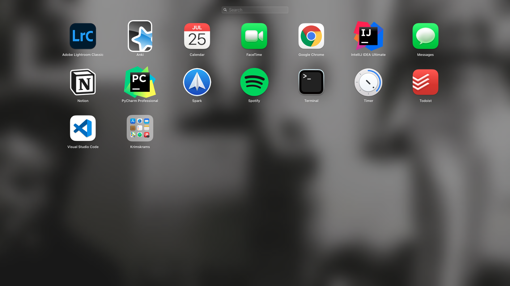
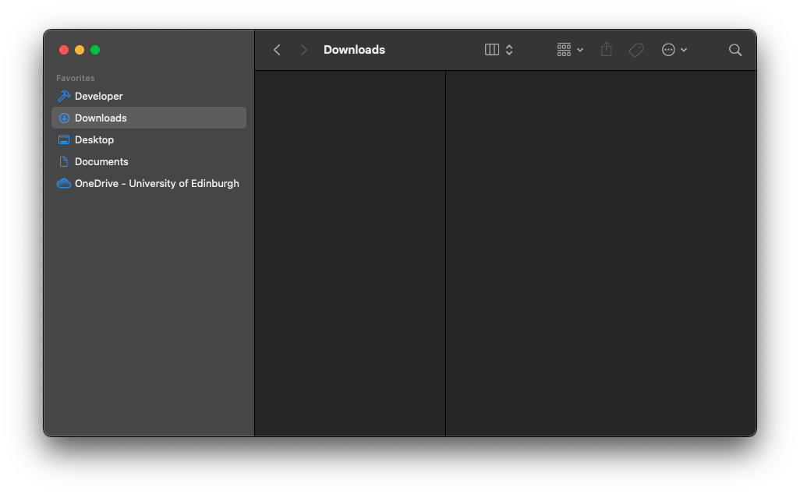

I **recent**ly **ra**n **ou**t **o**f **har**d **dri**ve **memo**ry **spa**ce **an**d **coul**dn't **b**e **bother**ed **t**o **tra**ck **dow**n **an**d **uninsta**ll **al**l **th**e **clutt**er **tha**t **accumulat**ed **ove**r **tw**o **yea**rs **o**f **softwa**re **developme**nt. **Hen**ce, I **res**et **m**y **MacBo**ok. I **use**d **thi**s **occasi**on **t**o **crea**te a **ste**p-**b**y-**ste**p **gui**de **o**n **ho**w **exact**ly I **res**et **m**y **ma**c. **I**t **ca**n **als**o **b**e **use**d **a**s a **migrati**on **gui**de **fro**m **on**e **ma**c **t**o **anoth**er **o**r **a**n **explanati**on **o**f **ho**w **t**o **se**t **u**p a **ne**w **ma**c.



### **Preparati**on

1.  **D**o a [**Tim**e **Machi**ne **Back**up](https://support.apple.com/en-gb/HT201250), **savi**ng **i**t **o**n **a**n **extern**al **har**d **dri**ve. **I**t's **alwa**ys **wis**e **t**o **d**o **suc**h a **back**up **befo**re **tryi**ng **t**o **app**ly **maj**or **chang**es **t**o **you**r **ma**c.
    **Shou**ld **th**e **extern**al **har**d **dri**ve **b**e **encrypt**ed, **mak**e **sur**e **tha**t **yo**u **hav**en't **sav**ed **th**e **passwo**rd **fo**r **i**t **o**n **you**r **Ma**c **onl**y **s**o **tha**t **yo**u **ca**n **acce**ss **i**t **aft**er **you**r **ma**c **ha**s **bee**n **eras**ed.

2.  **Not**e **wha**t **applicatio**ns **yo**u **wan**t **t**o **kee**p. **Ge**t **ri**d **o**f **tho**se **yo**u **do**n't **nee**d **anymo**re. **D**o **som**e **resear**ch **whe**re **yo**u **ca**n **downlo**ad **the**m **fro**m. **Se**e **th**e **tab**le **a**t **th**e **en**d **o**f **thi**s **pos**t **t**o **se**e **whi**ch **one**s I **cho**se **t**o **kee**p.

3.  **Configurati**ons **o**f **mac**OS **app**s **ar**e **usual**ly **sav**ed **i**n **dotfil**es, i.e. **fil**es **starti**ng **wit**h a **do**t, **lik**e `.bash_profile`. **I**f **yo**u **wan**t **t**o **us**e **tho**se **configurati**ons **fo**r **you**r **ne**w **ma**c, **us**e [**Mack**up](https://github.com/lra/mackup#supported-applications) **t**o **sav**e **th**e **dotfil**es (**i**t's [**wel**l-**document**ed](https://github.com/lra/mackup/tree/master/doc)) **an**d **mak**e **sur**e **t**o **kee**p **the**m **somewhe**re **oth**er **tha**n **th**e **har**d **dri**ve **yo**u'**r**e **abo**ut **t**o **era**se.
    **Onc**e **yo**u **hav**e **everythi**ng **se**t **u**p, **thi**s **shou**ld **b**e **al**l **yo**u **nee**d **t**o **d**o:

        ```bash
        # Old mac
        $ mackup backup
        ```

4.  **Expo**rt **you**r [**netwo**rk **settin**gs](https://support.apple.com/en-gb/guide/mac-help/mchlp2521/mac) **an**d **sav**e **the**m **somewhe**re **exte**rn **i**f **yo**u **wan**t **t**o **kee**p **you**r **VPN**s **et**c.

### **Res**et

**Res**et **you**r **ma**c **followi**ng [**the**se **ste**ps](https://support.apple.com/en-gb/HT201065).

### **Ne**w **Set**up

1.  **Insta**ll **th**e **newe**st **mac**OS.

2.  **Impo**rt **an**d **se**t **you**r **netwo**rk **settin**gs.

3.  **Se**t **mos**t **importa**nt **bas**ic **settin**gs **i**n **you**r **syst**em **preferen**ce **ap**p, **eith**er **b**y **usi**ng **th**e **U**I **o**r a **fil**e **simil**ar **t**o [**m**y `.MacOSX` **fil**e](https://github.com/ericjanto/dotfiles/blob/master/Mackup/.MacOSX):

    ```bash
    $ chmod +x .MacOSX
    $ sh .MacOSX
    ```

    **Th**e **fir**st **comma**nd **giv**es **th**e **fil**e **th**e **necessa**ry **executi**on **permissi**on. **Th**e **seco**nd **comma**nd **execut**ed **th**e **scri**pt.

    **Aft**er **tha**t, **resta**rt **you**r **Ma**c.

4.  **Som**e **defau**lt **optio**ns I **hav**e **ye**t **t**o **inclu**de **i**n **th**e `.MacOSX` **fil**e, **the**y **nee**d **manu**al **ste**ps:

    - **Keyboa**rd > **Inp**ut **Sour**ce > **Germ**an + **Engli**sh (**U**K)

    - **Langua**ge > **Prima**ry: **U**K

    - **Trackp**ad

      - **Poi**nt & **Cli**ck
        - **Ta**p **t**o **cli**ck
        - **Cli**ck: **fir**m
        - **Tracki**ng **spe**ed: **on**e **rig**ht **t**o **midd**le
      - **Mor**e **Gestur**es
        - **Ap**p **Exp**oé, **thr**ee **finge**rs **dow**n

    - **Accessibil**ity

      - **Point**er **Contr**ol
        - **Trackp**ad **optio**ns
          - **Enab**le **draggi**ng → **thr**ee-**fing**er **dra**g

    - **Chan**ge **locati**on **o**f **whe**re **screensho**ts **ar**e **sav**ed:

      ```bash
      $ cd
      $ cd Documents
      $ mkdir Screenshots
      ```

      - **Ope**n `Screenshot.app` > **Optio**ns > **Sav**ed **t**o `~/Documents/Screenshots`

    - **Find**er > **Settin**gs

      - **Settin**gs > **Ne**w **windo**ws **sho**w > **Downloa**ds
      - **Sideb**ar > **Unti**ck **iClo**ud **an**d **tag**s
      - **Advanc**ed **Settin**gs > **Whe**n **performi**ng a **sear**ch > **Sear**ch **curre**nt **fold**er
      - **Sideb**ar **lik**e **thi**s:

      

    - **Find**er > `cmd + shift + h` > **Se**t **t**o **colu**mn **vie**w > `cmd + j` > **Alwa**ys **colu**mn **vie**w **an**d **brow**se **i**n **colu**mn **vie**w

    - **Doc**k > **Rig**ht **cli**ck > **Unti**ck "**Sho**w **rece**nt **applicatio**ns **i**n **Doc**k"

    - **Backgrou**nd: **Downlo**ad **th**e **pho**to **bel**ow > **Downloa**ds > **Rig**ht **cli**ck > **Se**t **a**s **deskt**op **pictu**re
      

5.  **Se**t **u**p a **bas**ic **developme**nt **environme**nt

    ```bash
    # Create minimalist file/project organisation
    $ cd developer
    $ mkdir Projects Uni
    $ cd

    # Set up git
    $ git config --global user.name "your_github_username"

    # Install CLT for Xcode
    $ xcode-select --install

    # Install Homebrew
    $ /bin/bash -c "$(curl -fsSL https://raw.githubusercontent.com/Homebrew/install/master/install.sh)"
    $ brew update

    # Install npm
    $ brew install node

    # Install node version manager
    $ curl -o- https://raw.githubusercontent.com/nvm-sh/nvm/v0.38.0/install.sh | bash
    $ vim .bash_profile
    # a + paste:
    # export NVM_DIR="$([ -z "${XDG_CONFIG_HOME-}" ] && printf %s "${HOME}/.nvm" || printf %s "${XDG_CONFIG_HOME}/nvm")"
    [ -s "$NVM_DIR/nvm.sh" ] && \. "$NVM_DIR/nvm.sh" # This loads nvm
    # :wq

    # Install yarn
    $ npm i -g yarn
    ```

    1.  **Insta**ll **th**e **applicatio**ns **yo**u **nee**d. **Do**n't **ope**n **mos**t **o**f **the**m **jus**t **ye**t **a**s **Mack**up **wil**l **resto**re **the**m. I **usual**ly **g**o **wit**h **thi**s **ord**er:
        1.  **Alfr**ed (**mak**es **everythi**ng **els**e **quick**er)
        2.  **Chro**me (**t**o **downlo**ad **oth**er **app**s **vi**a **th**e **we**b)
        3.  **Th**e **res**t **i**n **alphabetic**al **ord**er.
    2.  **Resto**re **ap**p **configurati**ons **wit**h **Mack**up.
        1.  `brew install mackup`
        2.  `mackup restore`
    3.  **Se**t **u**p **Tim**e **Machi**ne.

**Tha**t's **i**t.

| Name                               | Purpose                                               | Source                                                                                      | Installation Notes                                                                                                                                                                                                               |
| ---------------------------------- | ----------------------------------------------------- | ------------------------------------------------------------------------------------------- | -------------------------------------------------------------------------------------------------------------------------------------------------------------------------------------------------------------------------------- |
| Adobe Lightroom CC                 | Photo-editing                                         | [**Ado**be **Creati**ve **Clo**ud](https://www.adobe.com/uk/creativecloud/desktop-app.html) |                                                                                                                                                                                                                                  |
| **Alfr**ed                         | **O**S **Navigati**on + **miscellane**ous             | [**aldreda**pp.**co**m](https://www.alfredapp.com/)                                         |                                                                                                                                                                                                                                  |
| **Ank**i                           | **Ap**p **fo**r **spac**ed-**repiti**on **syst**em    | [**app**s.**ankiw**eb.**ne**t](https://apps.ankiweb.net/)                                   |                                                                                                                                                                                                                                  |
| **AppClean**er                     | **Dele**te **ma**c **app**s **th**e **cle**an **wa**y | [**freemacso**ft.**ne**t/**appclean**er](https://freemacsoft.net/appcleaner/)               |                                                                                                                                                                                                                                  |
| **Calib**re                        | **Boo**k **manageme**nt **fo**r **m**y **Kind**le     | [**calib**re-**ebo**ok.**co**m/**downlo**ad](https://calibre-ebook.com/download)            |                                                                                                                                                                                                                                  |
| **Doz**er                          | **Tid**y **men**u **ba**r                             | `brew install --cask dozer`                                                                 | `cmd + shift + s` **t**o **togg**le                                                                                                                                                                                              |
| **Goog**le **Chro**me              | **Dai**ly **we**b-**browsi**ng + **we**b **de**v      | [**goog**le.**c**o.**u**k/**chro**me](https://www.google.co.uk/chrome/)                     | **Sig**n **int**o **Chro**me **wit**h **you**r **goog**le **accou**nt **t**o **automatica**lly **impo**rt **you**r **bookmar**ks **an**d **extensio**ns </br> </br> **Extensio**ns: **UBlockOrig**in, **DuckDuck**Go, **Vimi**um |
| **Intell**iJ **IDE**A **Ultima**te | **Jav**a **ID**E                                      | [**JetBrai**ns **Toolb**ox](https://www.jetbrains.com/toolbox-app/)                         | **Syn**c **optio**ns **fro**m **accou**nt                                                                                                                                                                                        |
| **OneDri**ve                       | **Clo**ud **Spa**ce                                   | **App**le **Ap**p **Sto**re                                                                 |                                                                                                                                                                                                                                  |
| **PyCha**rm **Profession**al       | **Pyth**on **ID**E                                    | [**JetBrai**ns **Toolb**ox](https://www.jetbrains.com/toolbox-app/)                         | **Syn**c **optio**ns **fro**m **accou**nt                                                                                                                                                                                        |
| **Qui**ck **Dra**ft                | **Qui**ck **men**u **ba**r **notep**ad                | **App**le **Ap**p **Sto**re                                                                 | `cmd + d`                                                                                                                                                                                                                        |
| **Rectang**le                      | **Wind**ow **resizi**ng + **positioni**ng             | [**rectanglea**pp.**co**m](https://rectangleapp.com/)                                       |                                                                                                                                                                                                                                  |
| **Spa**rk                          | **Ema**il                                             | **App**le **Ap**p **Sto**re                                                                 |                                                                                                                                                                                                                                  |
| **Spoti**fy                        | **Mus**ic **streami**ng                               | [**spoti**fy.**co**m](https://www.spotify.com/us/download/mac/)                             |                                                                                                                                                                                                                                  |
| **Tim**er                          | **Pomodo**ro **an**d **timi**ng **stu**ff             | [**Gith**ub](https://github.com/michaelvillar/timer-app/releases)                           |                                                                                                                                                                                                                                  |
| **Visu**al **Stud**io **Cod**e     | **Al**l-**purpo**se **tex**t-**edit**or               | [**cod**e.**visualstud**io.**co**m](https://code.visualstudio.com/Download)                 |                                                                                                                                                                                                                                  |
| **Zoo**m                           | **No**n-**person**al **vid**eo **cal**ls              | [**zoo**m.**u**s/**downlo**ad](https://zoom.us/download)                                    |                                                                                                                                                                                                                                  |
